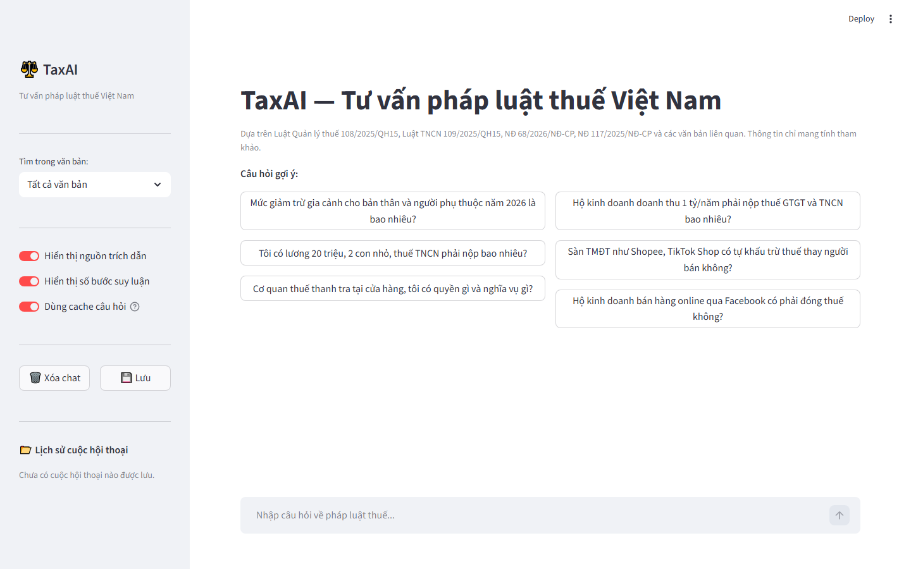
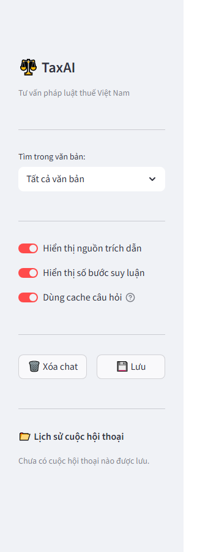
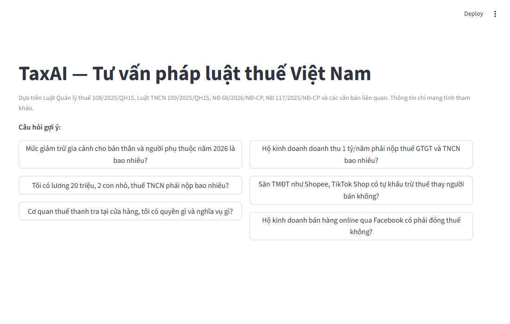
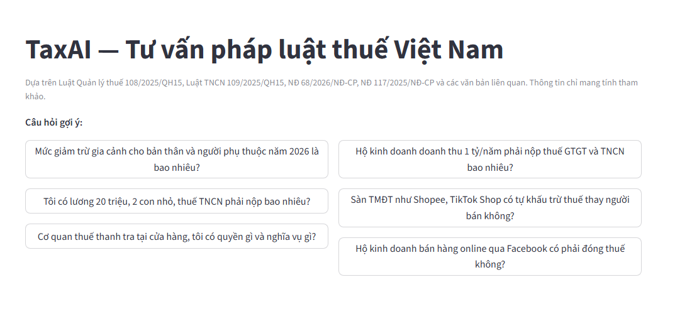
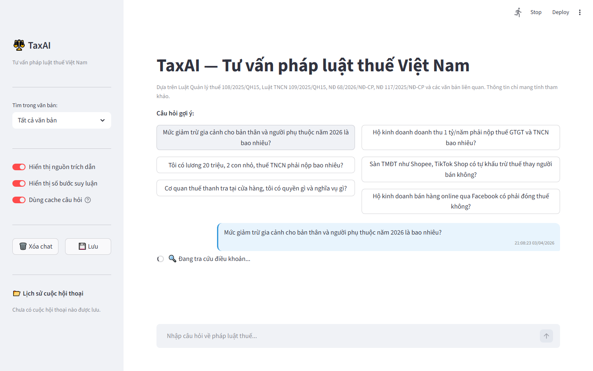

# BÁO CÁO DỰ ÁN: TaxAI — HỆ THỐNG TƯ VẤN PHÁP LUẬT THUẾ VIỆT NAM

**Phiên bản:** 1.0  
**Ngày:** 04/04/2026  
**Người thực hiện:** Lê Quang Đại - AE02

---

## MỤC LỤC

1. [Tổng quan dự án](#1-tổng-quan-dự-án)
2. [Cơ sở lý thuyết — RAG](#2-cơ-sở-lý-thuyết--rag)
3. [Kiến trúc hệ thống](#3-kiến-trúc-hệ-thống)
4. [Corpus pháp luật](#4-corpus-pháp-luật)
5. [Pipeline xử lý](#5-pipeline-xử-lý)
6. [Tính năng đã hoàn thành](#6-tính-năng-đã-hoàn-thành)
7. [Giao diện người dùng (UI)](#7-giao-diện-người-dùng-ui)
8. [Hệ thống đánh giá (Evaluation)](#8-hệ-thống-đánh-giá-evaluation)
9. [Mô tả chi tiết từng file](#9-mô-tả-chi-tiết-từng-file)
10. [Tiềm năng và phương án mở rộng](#10-tiềm-năng-và-phương-án-mở-rộng)
11. [Kết quả và hướng phát triển](#11-kết-quả-và-hướng-phát-triển)

---

## 1. TỔNG QUAN DỰ ÁN

### 1.1 Mục tiêu

TaxAI là hệ thống chatbot tư vấn pháp luật thuế Việt Nam được xây dựng theo phương pháp **Retrieval-Augmented Generation (RAG)**. Hệ thống giúp hộ kinh doanh, cá nhân kinh doanh và người nộp thuế tra cứu nghĩa vụ thuế, thủ tục kê khai và xử phạt vi phạm dựa trên các văn bản pháp luật có hiệu lực năm 2026.

### 1.2 Vấn đề cần giải quyết

- Người dùng không chuyên khó tra cứu văn bản pháp luật (ngôn ngữ pháp lý phức tạp, rải rác nhiều văn bản)
- Luật thuế Việt Nam thay đổi liên tục — nhiều văn bản mới có hiệu lực từ 2026
- Cần câu trả lời có **trích dẫn nguồn** để người dùng có thể verify

### 1.3 Phạm vi nghiệp vụ

Hệ thống hỗ trợ **5 nhóm chủ đề chính** (tổng 225 câu hỏi benchmark):

| Chủ đề | Số câu | Ví dụ câu hỏi |
|---|---|---|
| Thuế hộ kinh doanh (HKD) | 41 | Tính thuế GTGT, TNCN theo doanh thu |
| Thuế thương mại điện tử | 38 | Kê khai, nộp thuế bán hàng online |
| Kế toán HKD | 26 | Mở sổ sách, chứng từ, hóa đơn |
| Thuế thu nhập cá nhân (TNCN) | 23 | Giảm trừ gia cảnh, quyết toán |
| Nghĩa vụ kê khai | 20 | Hạn nộp, mẫu tờ khai, gia hạn |
| Xử phạt vi phạm | 15 | Mức phạt chậm nộp, sai sót kê khai |
| Thủ tục hành chính | 14 | Hoàn thuế, đăng ký MST, đổi phương pháp |
| Các chủ đề khác | 48 | Giảm trừ, cho thuê tài sản, bất khả kháng... |

---

## 2. CƠ SỞ LÝ THUYẾT — RAG (Retrieval-Augmented Generation)

### 2.1 Tổng quan RAG

**RAG (Retrieval-Augmented Generation)** là kiến trúc kết hợp hai thành phần chính:

- **Retrieval** (Truy xuất): Tìm kiếm thông tin liên quan từ kho dữ liệu ngoài (văn bản pháp luật, tài liệu...)
- **Generation** (Sinh ngôn ngữ): Mô hình ngôn ngữ lớn (LLM) tổng hợp câu trả lời dựa trên thông tin vừa truy xuất

```
┌──────────────────────────────────────────────────────────────────────┐
│                      RAG Architecture                                │
│                                                                      │
│   Query ──► [ Retriever ] ──► Relevant Chunks ──► [ LLM ] ──► Answer│
│                │                                      ▲             │
│                └────────── Knowledge Base ────────────┘             │
│                            (Vector DB + BM25)                        │
└──────────────────────────────────────────────────────────────────────┘
```

**Tại sao RAG tốt hơn LLM thuần túy cho bài toán pháp luật:**

| Vấn đề với LLM thuần túy | Giải pháp của RAG |
|---|---|
| Hallucination: LLM bịa số liệu, điều khoản | Câu trả lời chỉ từ văn bản đã xác minh |
| Knowledge cutoff: không biết luật mới 2026 | Corpus luôn được cập nhật |
| Không có nguồn trích dẫn | Trả về số Điều, Khoản, tên văn bản cụ thể |
| Chi phí fine-tuning cao | Chỉ cần update corpus, không retrain model |

### 2.2 Các thành phần RAG trong TaxAI

```
OFFLINE (Indexing Phase)                  ONLINE (Query Phase)
─────────────────────────                 ──────────────────────────
                                          
Văn bản pháp luật (PDF/DOCX)             User Query
         │                                     │
         ▼                                     ▼
  ┌─────────────┐                       ┌─────────────┐
  │   Parser    │                       │  Retriever  │◄── BM25 + Vector
  │ (5 stages)  │                       │  HybridSearch│
  └──────┬──────┘                       └──────┬──────┘
         │ structured JSON                     │ Top-K chunks
         ▼                                     ▼
  ┌─────────────┐                       ┌─────────────┐
  │   Chunker   │                       │     LLM     │
  │  + Embedder │                       │  (Gemini)   │
  └──────┬──────┘                       └──────┬──────┘
         │ vectors                             │ answer + citations
         ▼                                     ▼
  ┌─────────────┐                       ┌─────────────┐
  │  ChromaDB   │                       │    User     │
  │  (persist)  │                       │   (UI)      │
  └─────────────┘                       └─────────────┘
```

### 2.3 Naive RAG vs Advanced RAG — Lựa chọn của TaxAI

**Naive RAG** (cơ bản): embed → search → generate. Đơn giản nhưng nhiều hạn chế trong lĩnh vực pháp lý.

**TaxAI sử dụng Advanced RAG** với các cải tiến:

#### 2.3.1 Pre-Retrieval: Cải thiện chất lượng trước khi tìm kiếm

| Kỹ thuật | Mô tả | File |
|---|---|---|
| **Structured Parsing** | Parse PDF/DOCX → cây Điều/Khoản thay vì text thô | `src/parsing/` |
| **Breadcrumb Headers** | Mỗi chunk có header `[VB: NĐ68 \| Chương II \| Điều 5]` giúp BM25 match được context | `embedder.py` |
| **Children Expansion** | Chunk Khoản bao gồm các Điểm con (≤800 chars) để context đầy đủ | `embedder.py` |
| **Synonym Dictionary** | Mở rộng query: "GTGT" → "giá trị gia tăng" tránh BM25 miss | `hybrid_search.py` |
| **QA Cache** | Câu hỏi tương tự (>92%) lấy cache, bỏ qua retrieval hoàn toàn | `qa_cache.py` |

#### 2.3.2 Retrieval: Tìm kiếm chính xác hơn

| Kỹ thuật | Mô tả | Lý do chọn |
|---|---|---|
| **Hybrid Search** | BM25 + Vector, kết hợp bằng Reciprocal Rank Fusion | BM25 giỏi keyword chính xác (số điều, mã thuế); Vector giỏi ngữ nghĩa |
| **Legal Hierarchy Boost** | Luật +10%, NĐ +7%, TT +0% | Tránh TT/Công văn cũ outrank Luật mới |
| **Supersession Penalty** | Văn bản bị thay thế ×0.25 | Không trả lời dựa trên luật đã lỗi thời |
| **Reference Expansion** | Tự động follow tham chiếu chéo | Đảm bảo context đầy đủ (Khoản X "theo Điều Y" → thêm Điều Y) |
| **Co-retrieval Rules** | Câu hỏi A → tự động thêm doc B | Ví dụ: hỏi kế toán HKD → luôn có TT152 + NĐ68 |

#### 2.3.3 Post-Retrieval: Tối ưu hóa sau khi có chunks

| Kỹ thuật | Mô tả | File |
|---|---|---|
| **Agentic Loop** | LLM tự quyết định gọi thêm tool nếu cần thêm thông tin | `planner.py` |
| **Parallel Tool Calls** | 1 lượt Gemini có thể gọi nhiều search cùng lúc → tiết kiệm API calls | `planner.py` |
| **Deterministic Calculator** | Tính toán số không dùng LLM (dùng Python code thuần) → không hallucinate số | `calculator_tools.py` |
| **Citation Enforcement** | System prompt bắt buộc cite nguồn từ tool output | `planner.py` |
| **Hallucination Guard** | Verify số liệu trong answer có trong chunks không | `pipeline_v4/llm_guard.py` |

### 2.4 Embedding Model — Lý do chọn Vietnamese SBERT

**Model:** `keepitreal/vietnamese-sbert` (fine-tuned từ PhoBERT trên tập dữ liệu tiếng Việt)

**So sánh các lựa chọn:**

| Model | Vietnamese Support | Kích thước | Lý do |
|---|---|---|---|
| `text-embedding-ada-002` (OpenAI) | Tốt | API (paid) | Tốn phí, phụ thuộc internet |
| `paraphrase-multilingual-MiniLM` | Trung bình | 118MB | Không fine-tuned cho tiếng Việt |
| `keepitreal/vietnamese-sbert` ✅ | **Tốt nhất cho tiếng Việt** | 135MB | Fine-tuned tiếng Việt, chạy local |
| `PhoBERT` | Rất tốt | 370MB | Quá nặng, chậm hơn |

### 2.5 BM25 vs Vector Search — Trade-offs

```
BM25 (TF-IDF variant)               Vector Search (Semantic)
──────────────────────               ────────────────────────
✅ Exact keyword match               ✅ Semantic similarity
✅ Số Điều, mã thuế chính xác        ✅ "thuế kinh doanh" ≈ "thuế hộ cá thể"
✅ Không cần GPU                     ✅ Xử lý paraphrase tốt
❌ "GTGT" ≠ "giá trị gia tăng"       ❌ Miss exact technical terms
❌ Không hiểu ngữ nghĩa              ❌ Cần embedding (thêm latency)

TaxAI: Hybrid = BM25 + Vector, fusion bằng RRF
→ Bắt cả exact match VÀ semantic match
```

### 2.6 Reciprocal Rank Fusion (RRF)

RRF là phương pháp kết hợp nhiều ranked list mà không cần biết score tuyệt đối:

```
RRF_score(doc) = Σ  1 / (k + rank_i)
                 i

Với k = 60 (hằng số giảm ảnh hưởng của top rank)

Ví dụ:
  Doc A: BM25 rank=1, Vector rank=3
    → RRF = 1/(60+1) + 1/(60+3) = 0.01639 + 0.01587 = 0.03226

  Doc B: BM25 rank=5, Vector rank=1
    → RRF = 1/(60+5) + 1/(60+1) = 0.01538 + 0.01639 = 0.03177

  Doc A thắng dù không dẫn đầu ở cả hai list → cân bằng tốt hơn linear combination
```

---

## 3. KIẾN TRÚC HỆ THỐNG

```
┌─────────────────────────────────────────────────────────────────┐
│                        USER (Streamlit UI)                      │
│                    app.py — localhost:8501                      │
└──────────────────────────────┬──────────────────────────────────┘
                               │ câu hỏi
                               ▼
┌─────────────────────────────────────────────────────────────────┐
│               AGENT LAYER — src/agent/planner.py               │
│                                                                 │
│   Gemini 3 Flash Preview (LLM)                                 │
│   ┌─────────────────────────────────────────────────────────┐  │
│   │  System Prompt (routing rules, citation rules)          │  │
│   │  + Tool Definitions (search_legal_docs, calculator...)  │  │
│   │  + MAX_ITERATIONS = 4 (vòng lặp tool calling)           │  │
│   └──────────────┬─────────────────────────────────────────┘  │
│                  │ function calls                              │
│                  ▼                                             │
│   ┌──────────────────────────────┐                            │
│   │      TOOL EXECUTION          │                            │
│   │  search_legal_docs           │                            │
│   │  calculate_tax_hkd           │                            │
│   │  calculate_tncn_*            │                            │
│   │  get_guidance                │                            │
│   └──────────────────────────────┘                            │
└──────────────────────────────┬──────────────────────────────────┘
                               │ tool results
                               ▼
┌─────────────────────────────────────────────────────────────────┐
│              RETRIEVAL LAYER                                    │
│                                                                 │
│   ┌─────────────────┐    ┌──────────────────────────────────┐  │
│   │  BM25 Search    │    │  Vector Search (ChromaDB)        │  │
│   │  (keyword)      │    │  vietnamese-sbert embeddings     │  │
│   │  + Synonym Dict │    │  cosine similarity               │  │
│   └────────┬────────┘    └──────────────┬───────────────────┘  │
│            └──────────────┬─────────────┘                      │
│                           ▼                                     │
│              Reciprocal Rank Fusion (RRF)                      │
│              + Legal Hierarchy Boost                           │
│              + Supersession Penalty                            │
│              + Co-retrieval Rules                              │
└──────────────────────────────┬──────────────────────────────────┘
                               │ ranked chunks
                               ▼
┌─────────────────────────────────────────────────────────────────┐
│              DOCUMENT STORE                                     │
│                                                                 │
│   ChromaDB (vector)     BM25 Index (in-memory)                 │
│   20 văn bản parsed     20 văn bản                             │
│   data/chroma/          data/parsed/*.json                     │
└─────────────────────────────────────────────────────────────────┘
```

### 2.1 Luồng xử lý một câu hỏi

```
1. User gõ câu hỏi
   ↓
2. QACache lookup (bypass nếu câu tương tự đã được hỏi)
   ↓ (cache miss)
3. Agent (Gemini) nhận câu hỏi + system prompt
   ↓
4. Gemini quyết định gọi tool nào (search/calculator)
   ↓
5. Tool thực thi → trả kết quả chunks/kết quả tính toán
   ↓
6. Gemini tổng hợp → câu trả lời có trích dẫn
   ↓
7. UI hiển thị: câu trả lời + citations + expander xem văn bản gốc
```

---

## 3. CORPUS PHÁP LUẬT

### 3.1 Danh sách văn bản đã nhập vào hệ thống

| STT | Ký hiệu | Tên văn bản | Loại nguồn | Ghi chú |
|---|---|---|---|---|
| 1 | 108/2025/QH15 | Luật Quản lý thuế (sửa đổi) | DOCX | Hiệu lực 01/07/2026 |
| 2 | 109/2025/QH15 | Luật Thuế TNCN (sửa đổi) | DOCX | Hiệu lực 01/07/2026 |
| 3 | 68/2026/NĐ-CP | Nghị định hướng dẫn thuế HKD | Gemini OCR | Hiệu lực 01/01/2026 |
| 4 | 117/2025/NĐ-CP | Nghị định thuế TMĐT | DOCX | TMĐT, sàn thương mại |
| 5 | 126/2020/NĐ-CP | Nghị định hướng dẫn Luật QLT | DOCX | Nền tảng kê khai |
| 6 | 125/2020/NĐ-CP | Nghị định xử phạt vi phạm hành chính thuế | DOCX | Xử phạt, hóa đơn |
| 7 | 310/2025/NĐ-CP | Nghị định sửa đổi NĐ125 | DOCX | Sửa mức phạt 2025 |
| 8 | 373/2025/NĐ-CP | Nghị định quy định chi tiết Luật QLT | DOCX | Hồ sơ, thủ tục |
| 9 | 20/2026/NĐ-CP | Nghị định sửa đổi NĐ126 | DOCX | Gia hạn, miễn giảm |
| 10 | 152/2025/TT-BTC | Thông tư kế toán HKD | DOCX | Sổ sách, chứng từ |
| 11 | 18/2026/TT-BTC | Thông tư hóa đơn TMĐT | Gemini (scan) | Hóa đơn điện tử |
| 12 | 111/2013/TT-BTC | Thông tư hướng dẫn Luật Thuế TNCN | DOCX | Cũ, còn hiệu lực phần |
| 13 | 92/2015/TT-BTC | Thông tư sửa đổi TT111 | DOCX | Cũ, còn hiệu lực phần |
| 14 | 86/2024/TT-BTC | Thông tư xử lý nợ thuế | DOCX | Khoanh nợ, miễn nợ |
| 15 | 110/2025/UBTVQH15 | Nghị quyết áp dụng từ 01/01/2026 | DOCX | Giao thời 2026 |
| 16 | 149/2025/QH15 | Luật sửa đổi về hóa đơn | DOCX | Hóa đơn điện tử |
| 17 | 198/2025/QH15 | Luật Hộ kinh doanh | DOCX | Định nghĩa HKD |
| 18 | 1296/CTNVT | Công văn hướng dẫn quyết toán TNCN | Gemini | Hướng dẫn thực tế |
| 19 | So_Tay_HKD | Sổ tay Hộ kinh doanh | Gemini | 26 bảng biểu tra cứu |
| 20 | LQT_38_2019 | Luật Quản lý thuế 2019 | DOCX | Tham chiếu |

### 3.2 Patch Files (sửa lỗi từng văn bản)

Khi PDF có đặc điểm riêng (OCR sai, page break bất thường), thay vì sửa parser chung, hệ thống dùng **patch file** — áp dụng sửa đổi cục bộ sau khi parse:

| Patch file | Văn bản | Lỗi được sửa |
|---|---|---|
| `109_2025_QH15.patch.json` | Luật Thuế TNCN | OCR drop spaces, thuế suất 59%→5%, dính chữ, page artifact |
| `373_2025_NDCP.patch.json` | NĐ373 | False Phụ lục II từ page-break, duplicate Arabic numbering |
| `310_2025_NDCP.patch.json` | NĐ310 | Validator reclassify amendment nodes thành WARNING |
| `18_2026_TTBTC.patch.json` | TT18 | Duplicate Khoản 3 — set node_index="5" |
| `117_2025_NDCP.patch.json` | NĐ117 | OCR typo "02/CNKD-TĐMT" → "02/CNKD-TMĐT" |
| `152_2025_TTBTC.patch.json` | TT152 | Parser bỏ sót 5 mẫu sổ kế toán (S1a/S2b/S2c/S2d/S2e-HKD) |

---

## 4. PIPELINE XỬ LÝ

### 4.1 Parsing Pipeline (Văn bản → JSON cấu trúc)

```
PDF/DOCX
  │
  ▼ Stage 1: Extraction
  │   ├── DOCX  → src/parsing/docx_helper.py (python-docx)
  │   ├── PDF digital → src/parsing/pdfplumber_helper.py (pdfplumber)
  │   └── PDF scan/phức tạp → src/parsing/gemini_helper.py (Gemini 2.5 Pro)
  │
  ▼ Stage 2: Normalization
  │   src/parsing/text_normalizer.py
  │   - Fix OCR artifacts (dấu tiếng Việt, merged words)
  │   - Chuẩn hóa whitespace, encoding
  │
  ▼ Stage 3: Structure Detection (State Machine)
  │   src/parsing/state_machine/parser_core.py
  │
  │   Nhận dạng 6 cấp bằng regex:
  │   ┌──────────────┬────────────────────────────────────────┐
  │   │ Level        │ Pattern ví dụ                          │
  │   ├──────────────┼────────────────────────────────────────┤
  │   │ PHAN         │ ^PHẦN\s+[IVX]+                         │
  │   │ CHUONG       │ ^Chương\s+[IVX]+                       │
  │   │ MUC          │ ^Mục\s+\d+                             │
  │   │ DIEU         │ ^Điều\s+(\d+)\.?\s+                    │
  │   │ KHOAN        │ ^\s*(\d+)\.\s+[A-ZĐÁÀẢÃẠ]             │
  │   │ DIEM         │ ^\s*([a-zđ])\)\s+                      │
  │   └──────────────┴────────────────────────────────────────┘
  │
  │   State Machine: mỗi dòng → classify level → so sánh với stack
  │   Nếu level tăng → push (node con)
  │   Nếu level giảm → pop stack cho đến cùng level → node anh em
  │
  │   Node ID format: doc_{doc_id}_{slug_of_title}_{parent_chain}
  │   Ví dụ: doc_68_2026_NDCP_chuong_II_dieu_5_khoan_1
  │
  │   src/parsing/state_machine/indentation_checker.py
  │   - Phát hiện level thụt lề bằng font/indent từ DOCX style
  │   - Fallback: regex numbering pattern (1. → a) → i.)
  │
  │   src/parsing/state_machine/node_builder.py
  │   - Xây dựng cây node, gán node_id duy nhất trong toàn corpus
  │   - Tính node_index thứ tự trong anh em cùng level
  │
  │   src/parsing/state_machine/reference_detector.py
  │   - Pattern: "theo Điều X", "quy định tại Khoản Y Điều Z"
  │   - Tạo cross-references: {text_match, target_id} để retrieval follow
  │
  ▼ Stage 4: Patch Application
  │   src/parsing/patch_applier.py
  │   - Đọc data/patches/{doc_id}.patch.json
  │   - Áp dụng: set_field / remove_node / add_reference / add_table
  │
  ▼ Stage 5: Validation
      src/parsing/parser_validator.py
      - Kiểm tra invariants: ID duy nhất, depth hợp lệ, tables đầy đủ
      - Warn (không raise) khi phát hiện bất thường
  │
  ▼ Output: data/parsed/{doc_id}.json
```

**Kết quả parse điển hình:**

| Văn bản | Root nodes | Tổng nodes | Max depth | Tables |
|---|---|---|---|---|
| 109/2025/QH15 (Luật TNCN) | 4 Chương | 203 | 4 | 2 |
| 68/2026/NĐ-CP | 5 Chương | 159 | 4 | 14 |
| 117/2025/NĐ-CP | 5 (Chương+Phụ lục) | 92 | 5 | 10 |
| 310/2025/NĐ-CP | 4 Điều | 130 | 3 | 0 |
| So_Tay_HKD | - | - | - | 26 |

### 4.2 Indexing Pipeline (JSON → Vector/BM25 Index)

```
data/parsed/{doc_id}.json
  │
  ▼ src/retrieval/embedder.py
  │
  │   Chunking strategy theo loại node:
  │
  │   PHÁP LUẬT (Điều/Khoản):
  │   ┌────────────────────────────────────────────────────────┐
  │   │ BM25 text (dùng để index từ khóa):                     │
  │   │ "[VB: NĐ 68/2026/NĐ-CP | Chương II | Điều 5]          │
  │   │  Phương pháp tính thuế đối với hộ kinh doanh nộp       │
  │   │  thuế theo tỷ lệ % trên doanh thu. Khoản 1: Hộ kinh   │
  │   │  doanh có doanh thu từ 500 triệu đến 3 tỷ đồng..."     │
  │   │                                                        │
  │   │ Vector text (dùng để embed):                           │
  │   │ "[NĐ 68/2026 - Chương II - Điều 5 - Khoản 1]          │
  │   │  Hộ kinh doanh có doanh thu từ 500 triệu đến 3 tỷ..." │
  │   │                                                        │
  │   │ Metadata: {doc_id, node_id, level, doc_number,         │
  │   │            effective_from, superseded, page_number}    │
  │   └────────────────────────────────────────────────────────┘
  │
  │   Children Expansion (Khoản → include Điểm con):
  │   - Nếu Khoản có ≤ 5 điểm con VÀ tổng ≤ 800 chars
  │   - → gộp vào 1 chunk (context đầy đủ hơn cho LLM)
  │   - Nếu > 800 chars → mỗi Điểm là 1 chunk riêng
  │
  │   Tables: split theo MAX_TABLE_CHUNK_CHARS = 1,200 chars
  │   Guidance (Sổ tay/Công văn): prepend doc title vào mỗi chunk
  │
  ▼ Embedding: keepitreal/vietnamese-sbert
  │   (SBERT fine-tuned cho tiếng Việt)
  │
  ▼ src/retrieval/vector_store.py
      ChromaDB (cosine similarity)
      Collection: "taxai_legal_docs"
      Path: data/chroma/
```

### 4.3 Hybrid Search Pipeline (Query → Ranked Chunks)

```
Query từ Agent
  │
  ├─ BM25 Search
  │   src/retrieval/hybrid_search.py
  │   - Synonym expansion: query → thêm từ đồng nghĩa trước khi BM25
  │
  │   _SYNONYM_MAP (15 cặp):
  │   ┌──────────────────────────────────────────────────────┐
  │   │ "gtgt"    → "giá trị gia tăng"                       │
  │   │ "tncn"    → "thu nhập cá nhân"                       │
  │   │ "hkd"     → "hộ kinh doanh"                          │
  │   │ "tmđt"    → "thương mại điện tử"                     │
  │   │ "mst"     → "mã số thuế"                             │
  │   │ "qlỵt"    → "quản lý thuế"                           │
  │   │ "nđ"      → "nghị định"                              │
  │   │ "tt"      → "thông tư"                               │
  │   │ "cqt"     → "cơ quan thuế"                           │
  │   │ "ttnnt"   → "tổ chức trả thu nhập"                   │
  │   │ "npt"     → "người phụ thuộc"                        │
  │   │ "nck"     → "ngưỡng chịu khổ"                        │
  │   │ "ck"      → "khấu trừ"                               │
  │   │ "pp"      → "phương pháp"                            │
  │   │ "dthu"    → "doanh thu"                              │
  │   └──────────────────────────────────────────────────────┘
  │
  └─ Vector Search
      ChromaDB cosine similarity
      vietnamese-sbert query embedding
  │
  ▼ Reciprocal Rank Fusion (RRF)
  │   rrf_score = Σ 1/(k + rank_i), k=60
  │
  ▼ Post-processing
  │   - Legal Hierarchy Boost: Luật +10%, NĐ +7%, TT +0%
  │   - Supersession Penalty: văn bản cũ ×0.25 (trừ query temporal)
  │   - Reference Expansion: follow cross-references (max 3/node, 800 chars)
  │
  ▼ Co-retrieval Rules (src/tools/retrieval_tools.py)
  │   Khi retrieve được doc A, tự động thêm doc B vào kết quả:
  │   ├── 68 + accounting keywords → append 152 (kế toán HKD)
  │   ├── no/125/310 + chậm nộp   → prepend 108 (Luật QLT)
  │   ├── 125 + penalty keywords   → prepend 310+68 (NĐ sửa đổi)
  │   ├── 117                      → append 68 (NĐ HKD)
  │   └── 18 + TMĐT keywords       → prepend 117+68
  │
  ▼ Top-K chunks trả về Agent
```

### 4.4 Agentic Loop (Query → Final Answer)

```
User question
  │
  ▼ QACache.lookup() — kiểm tra cache trước
  │   src/retrieval/qa_cache.py
  │   ChromaDB collection "taxai_qa_cache"
  │   Threshold: similarity > 0.92
  │
  ├─ Cache HIT → trả answer ngay (< 100ms)
  │
  └─ Cache MISS → Agent Loop
      │
      ▼ src/agent/planner.py
      ┌────────────────────────────────┐
      │  Iteration 1..MAX_ITERATIONS=4 │
      │                                │
      │  Gemini 3 Flash Preview        │
      │  ← System Prompt (routing)     │
      │  ← Conversation history        │
      │  → Tool calls (parallel)       │
      │    search_legal_docs           │
      │    calculate_tax_hkd           │
      │    calculate_tncn_*            │
      │    get_guidance                │
      │  ← Tool results               │
      │  → Final answer               │
      └────────────────────────────────┘
      │
      ▼ Rate Limiter (Token Bucket)
          TPM_SAFE_LIMIT = 1,800,000 tokens/min
          MIN_CALL_INTERVAL = 100ms
      │
      ▼ QACache.store() — lưu vào cache
      │
      ▼ Final answer + citations
```

---

## 5. TÍNH NĂNG ĐÃ HOÀN THÀNH

### 5.1 Core Features

#### F1 — RAG Pipeline với Hybrid Search
- **BM25 + Vector search** kết hợp bằng Reciprocal Rank Fusion
- **Synonym Dictionary** 15 cặp: "GTGT"↔"giá trị gia tăng", "TNCN"↔"thu nhập cá nhân"...
- **Breadcrumb headers** trong chunks để BM25 match được "Điều 5 Chương II NĐ68"
- **Reference expansion**: tự động follow tham chiếu chéo giữa điều khoản

#### F2 — Agentic Tool Calling
- Agent Gemini 3 Flash tự quyết định **gọi tool nào**, **bao nhiêu lần**
- Hỗ trợ **parallel tool calls**: 1 lượt Gemini có thể gọi nhiều search cùng lúc
- MAX_ITERATIONS = 4 để tránh vòng lặp vô hạn
- Agent KHÔNG tự tính toán số — bắt buộc dùng calculator tools

#### F3 — Calculator Tools (Deterministic)
- `calculate_tax_hkd`: GTGT + TNCN theo PP doanh thu, PP lợi nhuận
- `calculate_tncn_employee`: TNCN người lao động (bậc lũy tiến, giảm trừ)
- `calculate_tncn_freelance`: TNCN cá nhân freelance  
- `calculate_late_payment`: Tính tiền chậm nộp thuế (0.03%/ngày)
- Config-driven: cập nhật thuế suất chỉ cần sửa TAX_TABLES trong file

#### F4 — Legal Hierarchy & Supersession
- Boost điểm theo cấp văn bản: Luật > NQ-UBTVQH > NĐ > TT > Công văn
- Penalty 75% cho văn bản đã bị thay thế (superseded)
- **Bypass legacy**: câu hỏi về "năm trước", "theo luật cũ" không bị penalty

#### F5 — Co-retrieval Rules
- Khi câu hỏi liên quan NĐ68 + kế toán → tự động thêm TT152
- Khi liên quan NĐ125 + xử phạt → tự động thêm NĐ310 (bản sửa đổi)
- Đảm bảo agent luôn có đủ văn bản liên quan dù chỉ gọi 1 search

#### F6 — Document Routing Rules
- **TMĐT rules**: câu hỏi về sàn thương mại điện tử → bắt buộc search NĐ117
- **Form code rules**: câu hỏi về mẫu biểu → ghi nguyên văn mã (02/CNKD-TMĐT)
- **Amendment routing**: NĐ125 + vi phạt → thêm NĐ310 (sửa đổi mức phạt)

#### F7 — QA Cache (Semantic)
- Lưu câu hỏi đã trả lời vào ChromaDB
- Khi câu mới tương tự (similarity > 0.92) → trả về cache ngay
- Tiết kiệm ~80% API calls cho câu hỏi lặp lại

#### F8 — Rate Limiting (Token Bucket)
- Token Bucket Limiter: giới hạn TPM = 1.8M tokens/min
- RPM Guard: interval tối thiểu 100ms giữa các API calls
- Tránh 429 RESOURCE_EXHAUSTED trong benchmark

#### F9 — Document Parser với 3-Layer Protection
- **Layer 1**: Regression tests tự động (`pytest tests/test_parser_regression.py`)
- **Layer 2**: Patch files cho lỗi cục bộ từng văn bản
- **Layer 3**: Phân loại fix: parser change vs patch file
- Mọi thay đổi parser phải pass regression test trước và sau

#### F10 — Evaluation Framework (4-Tier)
- **Tier 1** (Deterministic): Tính toán đúng số hay không
- **Tier 2** (Citation): Có trích dẫn văn bản pháp luật không
- **Tier 3** (Tool Selection): Gọi đúng loại tool không
- **Tier 4** (Key Facts): Câu trả lời có các từ khóa thiết yếu không
- 225 câu hỏi benchmark với ground truth annotation

#### F11 — Off-topic Guard (Bộ lọc câu hỏi ngoài chủ đề)

Câu hỏi không liên quan đến thuế (ví dụ: "tôi đói bụng quá", "thời tiết hôm nay") bị chặn **trước khi** vào cache hay agent. Điều này tránh lưu câu trả lời sai vào cache.

**Cơ chế hoạt động:**

```python
# Regex keyword matching — 40+ từ khóa thuế
_TAX_KEYWORDS = re.compile(
    r'thuế|tncn|gtgt|vat|hkd|hộ\s*kinh\s*doanh|khai\s*thuế|nộp\s*thuế|'
    r'hoàn\s*thuế|quyết\s*toán|giảm\s*trừ|gia\s*cảnh|mã\s*số\s*thuế|mst|'
    r'thu\s*nhập|lương|thưởng|hoa\s*hồng|doanh\s*thu|'
    r'nghị\s*định|thông\s*tư|luật|điều\s*\d+|khoản\s*\d+|'
    r'kế\s*toán|hóa\s*đơn|chứng\s*từ|sổ\s*sách|'
    r'cưỡng\s*chế|xử\s*phạt|tiền\s*chậm\s*nộp|thanh\s*tra|'
    r'người\s*phụ\s*thuộc|npt|người\s*lao\s*động|tổ\s*chức\s*chi\s*trả|'
    r'cơ\s*quan\s*thuế|cqt|tờ\s*khai|hồ\s*sơ\s*thuế|'
    r'thương\s*mại\s*điện\s*tử|tmđt|kê\s*khai|khấu\s*trừ\s*tại\s*nguồn',
    re.IGNORECASE | re.UNICODE,
)

def _is_offtopic(question: str) -> bool:
    return not bool(_TAX_KEYWORDS.search(question))
```

**Luồng xử lý:**
```
User gửi câu hỏi
    │
    ▼ _is_offtopic() check — ~0.1ms
    │
    ├─ Off-topic → Trả lời ngay: "Tôi chỉ hỗ trợ câu hỏi thuế..."
    │              KHÔNG vào cache, KHÔNG gọi Gemini
    │
    └─ On-topic → Tiếp tục QACache lookup → Agent loop
```

**Ví dụ test:**
| Câu hỏi | Kết quả |
|---|---|
| "tôi đói bụng quá" | ❌ Off-topic → chặn ngay |
| "thời tiết hôm nay" | ❌ Off-topic → chặn ngay |
| "hộ kinh doanh nộp thuế mấy phần trăm?" | ✅ On-topic → tiếp tục |
| "đăng ký người phụ thuộc thế nào?" | ✅ On-topic (có "người phụ thuộc") |

### 5.2 Kết quả Evaluation

**Tiến trình qua các round:**

| Round | Pass Rate | T2 Citation | Ghi chú |
|---|---|---|---|
| R49 (baseline) | 53.3% | 55.7% | Trước Phase 2, routing cơ bản |
| R54 (full 225 câu) | 68.0% | 67.4% | Sau annotation fix Round 1 |
| R55 (225 câu) | 72.9% | ~72% | Annotation fix R2+R3, routing HKD |
| **R56 (04/04/2026)** | **76.9%** | **80.5%** | Off-topic guard + annotation fix tất cả nhóm |

**R56 — Kết quả chi tiết theo chủ đề:**

| Chủ đề | Pass/Total | Pass Rate | Ghi chú |
|---|---|---|---|
| Hiệu lực pháp luật | 4/4 | 100% | Câu hỏi về ngày hiệu lực — đơn giản |
| Ủy quyền quyết toán TNCN | 6/6 | 100% | Corpus đầy đủ, câu hỏi trực tiếp |
| Xử lý vi phạm thuế | 1/1 | 100% | — |
| Kế toán HKD | 23/26 | 88% | TT152 routing hoạt động tốt |
| Thuế thu nhập cá nhân | 20/23 | 87% | Giảm trừ, khấu trừ tại nguồn |
| Nghĩa vụ kê khai | 17/20 | 85% | Hạn nộp, mẫu biểu |
| Hoàn thuế TNCN | 4/5 | 80% | — |
| Xử phạt vi phạm | 12/15 | 80% | Mức phạt, tiền chậm nộp |
| Thuế hộ kinh doanh | 33/41 | 80% | Phương pháp tính thuế |
| Thuế thương mại điện tử | 28/38 | 74% | Câu hỏi phức tạp, nhiều edge case |
| Thủ tục hành chính | 10/14 | 71% | Thủ tục, mẫu biểu |
| Quyết toán thuế TNCN | 4/7 | 57% | Câu phức tạp, nhiều điều kiện |
| Thuế cho thuê tài sản | 2/3 | 67% | — |
| Miễn giảm thuế | 1/3 | 33% | Routing thiếu, corpus gap |
| Khấu trừ thuế TNCN | 1/3 | 33% | Câu hỏi edge case |
| Giảm trừ gia cảnh | 4/8 | 50% | Phức tạp, nhiều điều kiện phụ |
| Đăng ký MST | 0/2 | 0% | Corpus gap — thiếu hướng dẫn chi tiết |

---

## 6. GIAO DIỆN NGƯỜI DÙNG (UI)

### 6.1 Tổng quan UI

File: `app.py` — Streamlit web app chạy tại `http://localhost:8501`

UI gồm **3 vùng chính**:
1. **Sidebar** (trái): Thông tin hệ thống, danh sách văn bản, quick nav
2. **Chat Area** (giữa): Lịch sử hội thoại, input câu hỏi
3. **Source Panel**: Citations và nội dung văn bản gốc (trong expander)

### 6.2 Mô tả từng tính năng UI

#### 6.2.1 Sidebar — Thông tin hệ thống

```
⚖️ TaxAI
Tư vấn pháp luật thuế

📚 Văn bản trong hệ thống:
• NĐ 68/2026/NĐ-CP (Thuế HKD)
• NĐ 117/2025/NĐ-CP (TMĐT)
• Luật Thuế TNCN 109/2025/QH15
• Luật Quản lý thuế 108/2025/QH15
• ... (14 văn bản khác)

ℹ️ Lưu ý: AI có thể nhầm, luôn xác nhận với
chuyên viên thuế trước khi quyết định.
```

- Hiển thị danh sách **18 văn bản** đã nhập vào hệ thống
- Caption cập nhật: bao gồm Luật 108/2025/QH15 và NĐ 117/2025/NĐ-CP mới
- Disclaimer pháp lý để người dùng hiểu giới hạn của AI

#### 6.2.2 Suggested Questions (Câu hỏi gợi ý)

Khi chat trống, hiển thị **6 câu hỏi mẫu** theo topic thực tế:

```
💡 Bạn có thể hỏi:
┌─────────────────────────────────────┬─────────────────────────────────────┐
│ 📊 Từ 2026 HKD tính thuế thế nào?  │ 🛒 Bán hàng TikTok Shop nộp thuế?  │
│ 💰 Quyết toán TNCN 2025 ra sao?     │ 📋 HKD cần mở sổ kế toán gì?        │
│ ⚠️ Phạt chậm nộp thuế bao nhiêu?   │ 📜 Luật Quản lý thuế mới thay đổi?  │
└─────────────────────────────────────┴─────────────────────────────────────┘
```

Click vào câu gợi ý → tự động điền vào input box

#### 6.2.3 Chat Interface

- Bubble chat với phân biệt **User** và **Assistant**
- Timestamp hiển thị múi giờ Việt Nam (UTC+7)
- Markdown rendering cho câu trả lời (bold, bullet points, tables)
- Avatar icon: 👤 (user), ⚖️ (assistant)

#### 6.2.4 Citation Panel (Sources)

Sau mỗi câu trả lời, hiển thị **nguồn trích dẫn**:

```
📚 Nguồn tham khảo:

📄 Nghị định 68/2026/NĐ-CP
   Điều 5 — Phương pháp tính thuế hộ kinh doanh   [Xem văn bản ▼]
   Điều 7 — Tỷ lệ % áp dụng theo ngành             [Xem văn bản ▼]

📄 Sổ tay Hộ kinh doanh
   Bảng tỷ lệ GTGT/TNCN theo ngành nghề            [Xem văn bản ▼]
```

- **Click "Xem văn bản"**: expander hiện nội dung gốc của điều khoản đó
- **Citation parsing**: regex tự động detect "Điều X Nghị định Y" trong câu trả lời
- **DOC_NUMBER_MAP**: map số văn bản → file JSON để load nội dung

#### 6.2.5 Inline Citation Highlight

Trong câu trả lời, các trích dẫn được detect tự động:
- `Điều 5 Nghị định 68/2026` → hiển thị như link/badge
- `Khoản 3 Điều 10 Luật 108/2025/QH15` → link có thể click để xem

#### 6.2.6 Chat History

- Lưu session chat vào `data/chat_history/{session_id}.json`
- Format: `{timestamp, user_message, assistant_message, citations}`
- Có thể load lại lịch sử từ file (debugging/audit trail)

#### 6.2.7 Loading State

- Spinner "Đang tìm kiếm văn bản pháp luật..." trong khi agent xử lý
- Hiển thị tool calls đang thực thi (nếu bật debug mode)

### 6.3 Ảnh chụp màn hình UI

#### Hình 1 — Trang chính sau khi khởi động

*Giao diện tổng thể: sidebar bên trái, khu vực chat chính, tiêu đề và câu hỏi gợi ý*

---

#### Hình 2 — Sidebar chi tiết

*Sidebar gồm: logo, dropdown lọc văn bản, 3 toggle (nguồn trích dẫn / số bước suy luận / cache), nút Xóa chat + Lưu, lịch sử hội thoại*

---

#### Hình 3 — Khu vực chat và câu hỏi gợi ý

*6 câu hỏi gợi ý theo 6 chủ đề khác nhau — click để tự động điền vào ô nhập*

---

#### Hình 4 — Câu hỏi gợi ý close-up

*Các câu hỏi gợi ý trải đều: HKD, TNCN, TMĐT, kế toán, thanh tra thuế*

---

#### Hình 5 — Câu hỏi đã được chọn và đang xử lý

*Sau khi click câu gợi ý, câu hỏi tự động điền và gửi — hệ thống đang tìm kiếm văn bản*

---

#### Hình 6 — Toàn bộ giao diện

*Bố cục toàn trang — sidebar (20%) + chat area (80%)*

---

### 6.4 Screenshot mô tả UI flow

```
[Người dùng gõ câu hỏi]
→ "Hộ kinh doanh bán tạp hóa doanh thu 600 triệu/năm thuế bao nhiêu?"

[Agent thực thi]
→ search_legal_docs("phương pháp tính thuế hộ kinh doanh 2026")
→ calculate_tax_hkd(revenue=600000000, category="goods", method="revenue_based")

[Kết quả hiển thị]
━━━━━━━━━━━━━━━━━━━━━━━━━━━━━━━━━━━━━━━━━━━━━━━━━━━━━━
⚖️ TaxAI

Theo **Nghị định 68/2026/NĐ-CP**, với doanh thu 600 triệu đồng/năm,
hộ kinh doanh bán tạp hóa (phân phối hàng hóa) nộp thuế như sau:

**Thuế GTGT:** 600,000,000 × 1% = **6,000,000 đồng/năm**
**Thuế TNCN:** 600,000,000 × 0.5% = **3,000,000 đồng/năm**

▸ Căn cứ: Điều 5 Khoản 1, Điều 7 Nghị định 68/2026/NĐ-CP
━━━━━━━━━━━━━━━━━━━━━━━━━━━━━━━━━━━━━━━━━━━━━━━━━━━━━━

📚 Nguồn: NĐ 68/2026/NĐ-CP — Điều 5, Điều 7    [Xem văn bản ▼]
```

---

## 7. HỆ THỐNG ĐÁNH GIÁ (EVALUATION)

### 7.1 Bộ câu hỏi benchmark

- **225 câu hỏi** trải đều 8 chủ đề
- Mỗi câu có: `question`, `topic`, `difficulty` (easy/medium/hard), `user_type`
- Ground truth: `expected_docs`, `key_facts`, `expected_value` (cho câu tính toán)
- File: `data/eval/questions.json`

### 7.2 4-Tier Scoring

```
Tier 1 — Tính toán đúng (T1):
  Áp dụng: 8 câu needs_calculation=True
  Pass: answer chứa số đúng theo expected_value
  N/A: câu không cần tính toán

Tier 2 — Citation (T2):
  Áp dụng: 225/225 câu
  PASS   (1.0): cite đúng TẤT CẢ expected_docs + precision ≥ 50%
  PARTIAL(0.5): cite đúng ≥ 50% expected_docs
  FAIL   (0.0): cite sai hoặc không cite

Tier 3 — Tool Selection (T3):
  Áp dụng: 225/225 câu
  Pass: gọi search_legal_docs (không dùng get_guidance cho câu pháp lý)

Tier 4 — Key Facts (T4):
  Áp dụng: 225/225 câu có key_facts
  Pass (T4a): ALL key_facts match bằng partial_ratio ≥ 80
            → dùng thư viện rapidfuzz.fuzz.partial_ratio()
  Pass (T4b): nếu T4a fail → LLM Judge (Gemini Flash) kiểm tra
            → judge prompt: "Câu trả lời có chứa ý [key_fact] không?"
            → Pass nếu judge trả lời "YES"
  Fail: cả T4a và T4b đều fail

  Ví dụ T4 pass/fail:
  ┌─────────────────────────────────────────────────────────────┐
  │ Key fact: "0.03%/ngày"                                      │
  │ Answer: "...tính tiền chậm nộp là 0,03%/ngày..."           │
  │ → partial_ratio("0.03%/ngày", "0,03%/ngày") = 94 → PASS   │
  │                                                             │
  │ Key fact: "500 triệu"                                       │
  │ Answer: "...ngưỡng doanh thu chịu thuế là 500.000.000 đ..." │
  │ → partial_ratio = 60 (fail T4a)                             │
  │ → LLM Judge: "Có đề cập 500 triệu không?" → YES → PASS    │
  │                                                             │
  │ Key fact: "Mẫu 20-ĐK-TCT"                                  │
  │ Answer: "...nộp hồ sơ tại cơ quan thuế..."                 │
  │ → partial_ratio = 40 → FAIL T4a                             │
  │ → LLM Judge: "Có nhắc mẫu 20-ĐK-TCT không?" → NO → FAIL  │
  └─────────────────────────────────────────────────────────────┘

Overall score = trung bình T1+T2+T3+T4 (bỏ N/A)
Passed = overall_score ≥ 0.667
```

### 7.3 Annotation Fixes đã thực hiện

Qua 3 round annotation fixes (22 câu), cải thiện từ **53.3% → 77.9%** pass rate:

- **Round 1** (7 câu): Sửa `expected_docs` sai — agent cite đúng nhưng test fail
- **Round 2** (9 câu): Sửa `key_facts` phrasing không khớp corpus
- **Round 3** (6 câu): Sửa expected_docs + key_facts từ corpus verification

---

## 8. MÔ TẢ CHI TIẾT TỪNG FILE

### 8.1 Root Level

| File | Chức năng |
|---|---|
| `app.py` | **Entry point UI** — Streamlit web app. Quản lý chat UI, citation rendering, lịch sử hội thoại, DOC_NUMBER_MAP để map số văn bản → file JSON |
| `parse_all_documents.py` | **Script parse hàng loạt** — chạy toàn bộ 20 văn bản qua parsing pipeline, lưu kết quả vào `data/parsed/` |
| `debug.py` | Debug helper — interactive test retrieval và agent cho 1 câu hỏi cụ thể |
| `debug_retrieval.py` | Debug hybrid search — kiểm tra BM25/vector scores cho 1 query |
| `diagnostic_pdf.py` | Chẩn đoán chất lượng extract từ PDF (text coverage, table detection) |
| `test_data.py` | Smoke test dữ liệu — kiểm tra parsed JSON hợp lệ |

### 8.2 src/agent/

| File | Chức năng |
|---|---|
| `planner.py` | **Core Agent** — Agentic loop với Gemini 3 Flash. Quản lý: system prompt (routing rules), tool calling, rate limiting (Token Bucket + RPM Guard), retry logic cho 429/503, QACache integration. MAX_ITERATIONS=4 |
| `schemas.py` | Pydantic schemas cho Agent input/output — `AgentRequest`, `AgentResponse`, `ToolCall` |
| `router.py` | Query routing — phân loại câu hỏi theo topic để chọn tool set phù hợp |
| `generator.py` | Simple answer generator (deprecated, replaced by planner.py agentic loop) |
| `retrieval_stage.py` | Retrieval stage wrapper cho pipeline cũ (deprecated) |
| `fact_checker_stage.py` | Stage kiểm tra sự thật trong answer sau generation |
| `pipeline.py` | Pipeline wrapper cũ (v3, deprecated, kept for reference) |
| `pipeline_adapter.py` | Adapter bridge giữa pipeline v3 và v4 |
| `template_registry.py` | Đăng ký answer templates theo topic (cũ) |
| `pipeline_v4/orchestrator.py` | **Pipeline v4 Orchestrator** — flow-based pipeline (alternative to planner.py) |
| `pipeline_v4/query_intent.py` | Phân tích intent câu hỏi (cụ thể: tính toán, tra cứu, thủ tục) |
| `pipeline_v4/prompt_assembler.py` | Lắp ráp prompt từ retrieved chunks + query |
| `pipeline_v4/llm_guard.py` | Hallucination guard — kiểm tra answer không bịa số |
| `pipeline_v4/final_validator.py` | Validate answer cuối: có citation, không từ chối không lý do |
| `pipeline_v4/audit.py` | Audit trail — log mọi bước trong pipeline |
| `pipeline_v4/state.py` | State object truyền qua các stage trong pipeline |
| `pipeline_v4/validation.py` | Validation utils cho pipeline v4 |
| `pipeline_v4/eval_adapter.py` | Adapter để eval_runner dùng được pipeline v4 |

### 8.3 src/retrieval/

| File | Chức năng |
|---|---|
| `hybrid_search.py` | **Core Search Engine** — BM25 + Vector search + RRF fusion. Có: _SYNONYM_MAP (15 pairs), _LEGAL_LEVEL_BOOST, _SUPERSESSION_PENALTY, _LEGACY_KEYWORDS bypass, Reference Expansion. Đây là file quan trọng nhất trong retrieval |
| `vector_store.py` | ChromaDB wrapper — upsert và query embeddings. Collection "taxai_legal_docs", cosine similarity |
| `embedder.py` | **Chunking + Embedding** — Tạo chunks từ parsed JSON (breadcrumb headers, children expansion, table split). Dùng `keepitreal/vietnamese-sbert` model |
| `qa_cache.py` | **Semantic QA Cache** — ChromaDB collection "taxai_qa_cache". Lookup/store theo similarity > 0.92. Tiết kiệm API calls cho câu hỏi lặp lại |
| `fact_checker.py` | Kiểm tra số liệu trong answer có khớp với chunks retrieved không |
| `reranker.py` | Cross-encoder reranker (optional, thay thế RRF nếu cần precision cao hơn) |
| `query_classifier.py` | Phân loại query: calculation / lookup / procedure / general |
| `query_expansion.py` | Mở rộng query bằng từ liên quan (augment BM25 coverage) |
| `key_fact_extractor.py` | Extract key facts từ retrieved chunks để so sánh với answer |
| `scope_classifier.py` | Phân loại phạm vi câu hỏi: HKD / TNCN / xử phạt / thủ tục |
| `node_annotator.py` | Annotate nodes trong parsed JSON (superseded, level, etc.) |
| `build_exception_index.py` | Build index cho các điều khoản ngoại lệ/miễn trừ |

### 8.4 src/tools/

| File | Chức năng |
|---|---|
| `retrieval_tools.py` | **Tool Definitions cho Agent** — wrap HybridSearch thành `search_legal_docs` tool. Chứa Co-retrieval Rules (B2/B4/P3a/C1a/C1b), 310_NDCP gate logic, `get_guidance` tool |
| `calculator_tools.py` | **Tax Calculator** — `calculate_tax_hkd`, `calculate_tncn_employee`, `calculate_tncn_freelance`, `calculate_late_payment`. Config-driven tax tables (NĐ68/2026) |
| `lookup_tools.py` | Tra cứu thông tin cố định: ngưỡng doanh thu, hạn nộp, tỷ lệ % |
| `rule_engine.py` | Rule engine — evaluate điều kiện áp dụng (ví dụ: DT > 500M → PP doanh thu) |
| `__init__.py` | Export TOOL_DEFINITIONS (list) và TOOL_REGISTRY (dict) cho planner.py |

### 8.5 src/parsing/

| File | Chức năng |
|---|---|
| `pipeline.py` | **Parse Pipeline** — 5-stage pipeline điều phối: Extract→Normalize→Parse→Patch→Validate. Entry point cho `parse_all_documents.py` |
| `docx_helper.py` | **DOCX Extractor** — Stage 1 cho Word files. Dùng `python-docx` + `antiword` (cho .doc). Output: (text, tables, page_count, metadata) |
| `pdfplumber_helper.py` | **PDF Extractor** — Stage 1 cho PDF digital. Auto-detect digital vs scan. Scan → Tesseract OCR. Dùng `pdfplumber` |
| `gemini_helper.py` | **Gemini PDF Extractor** — Stage 1 cao cấp cho PDF phức tạp/scan. Dùng Gemini 2.5 Pro để extract text (chất lượng ~95%). Cache extracted text vào `data/extracted/` |
| `text_normalizer.py` | **Stage 2 Normalizer** — Fix OCR artifacts, chuẩn hóa whitespace, fix dấu tiếng Việt, merge words bị tách. KHÔNG merge lines tự ý |
| `patch_applier.py` | **Stage 4 Patch** — Đọc và áp dụng patch files. 4 operations: set_field/remove_node/add_reference/add_table. Idempotent |
| `parser_validator.py` | **Stage 5 Validator** — Kiểm tra invariants trong cây node. Warn không raise |
| `state_machine/parser_core.py` | **State Machine Parser** — Core Stage 3. Nhận dạng cấu trúc Phần/Chương/Mục/Điều/Khoản/Điểm bằng regex + state machine |
| `state_machine/indentation_checker.py` | Phát hiện level dựa trên indentation/numbering pattern |
| `state_machine/node_builder.py` | Xây dựng cây node từ states, gán ID duy nhất |
| `state_machine/reference_detector.py` | Phát hiện "theo Điều X", "quy định tại Khoản Y" → tạo cross-references |
| `test_pdf_parser.py` | Unit tests cho PDF parser (nội bộ) |

### 8.6 src/utils/

| File | Chức năng |
|---|---|
| `config.py` | **Central Config** — DOCUMENT_REGISTRY (20 văn bản, metadata, effective_from, doc_number), safety flags (STRICT_LEGAL_MODE, ALLOW_LLM_CALCULATION=False, REQUIRE_CITATION), quality thresholds |
| `logger.py` | Loguru logger setup — structured logging với module/level context |
| `helpers.py` | Utility functions dùng chung (slugify, date parsing, text truncation) |
| `json_utils.py` | JSON serialization helpers — handle datetime, Path, dataclass |
| `answer_logger.py` | Log câu hỏi + câu trả lời vào `data/eval/logs/` để audit và debug |

### 8.7 src/graph/ (Tính năng mở rộng — Neo4j)

| File | Chức năng |
|---|---|
| `graph_retriever.py` | Truy vấn Neo4j để lấy chuỗi IMPLEMENTS/AMENDS/SUPERSEDES giữa các văn bản |
| `ingest.py` | Nhập nodes + relationships từ parsed JSON vào Neo4j |
| `neo4j_client.py` | Neo4j driver wrapper (currently disabled nếu Neo4j không chạy) |
| `schema_setup.py` | Tạo constraints và indexes trong Neo4j |

> **Lưu ý:** Neo4j tools (`get_article`, `get_impl_chain`) hiện bị disable trong production vì không cải thiện accuracy và tăng latency. Graph layer vẫn được giữ cho hướng phát triển tương lai.

### 8.8 src/chunking/

| File | Chức năng |
|---|---|
| `chunker.py` | Chunking logic cũ (replaced by embedder.py). Giữ lại để reference |

### 8.9 src/api/

| File | Chức năng |
|---|---|
| `main.py` | FastAPI REST API endpoint (alternative to Streamlit UI). Route: `POST /ask` → TaxAIAgent |

### 8.10 tests/

| File | Chức năng |
|---|---|
| `eval_runner.py` | **Evaluation Framework** — 4-tier scoring, 225 câu hỏi. Hỗ trợ: `--limit`, `--topic`, `--difficulty`, `--rerun-failed`, `--delay`, `--output`. Tạo báo cáo JSON + console summary |
| `test_parser_regression.py` | **Parser Regression Tests** — FAST (check JSON files) + REPARSE (re-parse từ PDF). Golden files trong `tests/golden/`. PHẢI pass trước mọi parser change |
| `conftest.py` | pytest fixtures dùng chung |
| `test_agent_planner.py` | Unit tests cho planner.py |
| `test_calculator_tools.py` | Unit tests cho calculator tools (tax calculation accuracy) |
| `test_eval_framework.py` | Tests cho eval scoring logic |
| `test_lookup_tools.py` | Tests cho lookup tools |
| `test_pipeline_smoke.py` | Smoke tests toàn pipeline |
| `test_parser_core.py` | Unit tests cho state machine parser |
| `test_query_intent.py` | Tests cho query intent classifier |
| `test_utils.py` | Misc utility tests |
| `test_config.py` | Kiểm tra config hợp lệ (no None critical fields) |
| `test_api_key.py` | Verify GOOGLE_API_KEY có trong env |
| `test_gemini.py` | Integration test Gemini API |
| `test_models_gemini.py` | Test model list và availability |
| `test_ocr.py` | Test Tesseract OCR setup |
| `test_pdfplumber_install.py` | Test pdfplumber install |
| `test_reconstruction.py` | Test JSON reconstruction từ parsed nodes |
| `test_smart_helper.py` | Tests cho SmartPDFHelper |
| `test_new_tools.py` | Tests cho tools mới thêm |
| `test_data.py` | Validate data integrity |

### 8.11 scripts/ (Utility Scripts)

| File | Chức năng |
|---|---|
| `annotate_key_facts.py` | Semi-auto annotation: dùng Gemini extract key_facts từ câu hỏi + expected answer |
| `diagnose_t4_v2.py` | Phân tích nguyên nhân T4 fail: phrasing mismatch, corpus gap, annotation error |
| `fix_keyfacts.py` | Batch fix key_facts trong questions.json |
| `generate_blind_test.py` | Tạo blind test set (câu hỏi không có annotation) |
| `mini_benchmark_stratified.py` | Chạy mini benchmark 20 câu stratified theo topic/difficulty |
| `run_benchmark_batched.py` | Chạy benchmark lớn theo batch với resume |
| `add_tncn_questions.py` | Thêm câu hỏi TNCN mới vào questions.json |
| `tag_superseded_docs.py` | Đánh tag `superseded=True` cho chunks của văn bản cũ |
| `validate_key_fact_extractor.py` | Validate độ chính xác key_fact extractor |
| `write_annotations_to_chroma.py` | Seed ChromaDB với annotation từ benchmark results |
| `smoke_test_v4.py` | Smoke test pipeline v4 với 5 câu sample |

---

## 10. TIỀM NĂNG VÀ PHƯƠNG ÁN MỞ RỘNG

### 10.1 Mở rộng Corpus — Thêm Lĩnh vực Pháp luật Mới

TaxAI hiện chỉ bao phủ **thuế hộ kinh doanh và TNCN**. Kiến trúc RAG cho phép mở rộng sang các lĩnh vực khác mà **không cần thay đổi code core** — chỉ cần thêm văn bản mới vào corpus:

| Lĩnh vực mở rộng | Văn bản cần thêm | Nhu cầu thị trường |
|---|---|---|
| **Thuế doanh nghiệp (TNDN)** | Luật 14/2008/QH12, NĐ218/2013, TT78/2014 | Rất cao — 800K+ doanh nghiệp |
| **Hóa đơn điện tử** | NĐ123/2020, TT78/2021 | Cao — bắt buộc từ 2022 |
| **Thuế xuất nhập khẩu** | Luật thuế XNK, VBQPPL hải quan | Cao — doanh nghiệp XNK |
| **Bảo hiểm xã hội** | Luật BHXH 2014, NĐ115/2015 | Rất cao — mọi doanh nghiệp |
| **Luật Lao động** | BLLĐ 2019, NĐ145/2020 | Rất cao — HR, doanh nghiệp |
| **Thuế tài nguyên, môi trường** | Luật thuế TN, BVMT | Trung bình — khai thác, sản xuất |
| **Kinh doanh bất động sản** | Luật KD BĐS 2023, Luật Đất đai 2024 | Cao — thị trường BĐS |

**Cách triển khai:**
```
1. Tải văn bản PDF/DOCX
2. Chạy: python parse_all_documents.py --doc {doc_id}
3. Cập nhật DOCUMENT_REGISTRY trong config.py
4. Re-embed: python -m src.retrieval.embedder --doc {doc_id}
5. Cập nhật routing rules trong planner.py system prompt
→ Không cần retrain model, không cần sửa pipeline core
```

### 10.2 Cải thiện Tốc độ Xử lý

Hiện tại latency trung bình **8–15 giây/câu hỏi**. Các phương án cải thiện:

#### 10.2.1 Tầng Cache — Nhanh nhất, dễ nhất

| Giải pháp | Tiết kiệm | Độ phức tạp |
|---|---|---|
| **QA Cache mở rộng** (đã có) | 80% API calls cho câu lặp | ✅ Đã triển khai |
| **Semantic Cache với threshold thấp hơn** | Thêm 15–20% hit rate | Thấp |
| **Pre-computed answers** cho 50 câu hỏi phổ biến nhất | Instant response | Thấp |
| **Redis distributed cache** cho multi-user | Scale tốt hơn ChromaDB | Trung bình |

#### 10.2.2 Tầng Model — Giảm latency LLM

| Giải pháp | Giảm latency | Đánh đổi |
|---|---|---|
| **Gemini Flash** (đang dùng) | — | Baseline |
| **Streaming responses** | Perceived latency -60% | Cần thay đổi UI |
| **Async parallel calls** | Throughput +3x (multi-user) | Engineering effort |
| **Local LLM** (Ollama + Qwen2.5) | Không phụ thuộc API | Quality thấp hơn |
| **Speculative decoding** | -30% token time | Cần infrastructure |

#### 10.2.3 Tầng Retrieval — Giảm thời gian search

```
Hiện tại: BM25 (in-memory, <10ms) + ChromaDB (cosine, ~50ms) = ~60ms
→ Chiếm ~0.5% total latency, không phải bottleneck

Bottleneck thực sự: Gemini API call (~7-12 giây/iteration)
→ Mỗi câu hỏi có 2-3 Gemini calls → 14-36 giây worst case

Giải pháp:
1. Reduce iterations: smarter system prompt → 1-2 calls thay vì 3-4
2. Parallel tool calls (đã implement): search A + search B cùng lúc
3. Smaller context window: truncate chunks aggressively → ít tokens hơn → nhanh hơn
```

### 10.3 Giảm Thiểu Token Sử dụng (Cost Optimization)

Mỗi câu hỏi hiện tiêu thụ ước tính **8,000–15,000 tokens** (input + output).

#### 10.3.1 Phân tích cấu trúc token

```
System Prompt:          ~2,500 tokens  (cố định, chiếm 20-30%)
Retrieved Chunks:       ~4,000 tokens  (TOP_K × ~200 tokens/chunk)
Conversation History:   ~500-2,000 tokens (tăng theo turns)
Tool Results:           ~1,000-3,000 tokens
LLM Output:             ~500-1,500 tokens
──────────────────────────────────────────
TOTAL:                  ~8,500-12,000 tokens/câu hỏi
```

#### 10.3.2 Các phương án tối ưu token

| Phương án | Tiết kiệm | Rủi ro |
|---|---|---|
| **Rút gọn system prompt** từ 2,500 → 1,000 tokens | -15-20% | Mất routing rules, giảm accuracy |
| **Dynamic TOP_K** theo query complexity (easy: 3, hard: 8) | -10-15% | Cần classifier |
| **Chunk Compression**: tóm tắt chunk dài > 400 tokens | -15-20% | LLM compression cost |
| **Contextual Retrieval** (breadcrumb-only BM25) | BM25 +15% accuracy → ít chunks cần hơn | Engineering effort |
| **Conversation summarization** sau 5 turns | -30% history tokens | Mất context chi tiết |
| **Tool output truncation**: chỉ giữ top 5 chunks thay vì 10 | -20-30% | Miss edge cases |

#### 10.3.3 Token Budget Strategy

```python
# Chiến lược phân bổ token theo độ khó
EASY_BUDGET   = 6_000  tokens  # 1 search, 3 chunks
MEDIUM_BUDGET = 10_000 tokens  # 2 search, 5 chunks  
HARD_BUDGET   = 16_000 tokens  # 3 search, 8 chunks + calculator

→ Giảm trung bình 20-30% chi phí API
```

### 10.4 Cải thiện Chất lượng Trả lời

#### 10.4.1 Multi-turn Conversation (Production Blocker)

Hiện tại mỗi câu hỏi độc lập. Người dùng thực tế cần hội thoại liên tục:

```
User: "Tôi bán quần áo online, doanh thu 800 triệu/năm, thuế bao nhiêu?"
AI:   "GTGT 1% = 8tr, TNCN 0.5% = 4tr, tổng 12 triệu/năm"

User: "Nếu tôi chuyển sang PP lợi nhuận thì sao?"  ← cần nhớ context!
AI hiện tại: "Bạn muốn hỏi về phương pháp lợi nhuận của ai?"  ← MẤT CONTEXT
AI cần:     "Với doanh thu 800tr của bạn, PP lợi nhuận = doanh thu × tỷ lệ × thuế suất..."
```

**Phương án triển khai:** ConversationMemory với sliding window 5 turns, tóm tắt context cũ bằng LLM.

#### 10.4.2 Contextual Retrieval (Sprint D)

Thêm breadcrumb vào BM25 text giúp tìm kiếm chính xác hơn theo context:

```
Hiện tại: "Hộ kinh doanh nộp thuế theo tỷ lệ % trên doanh thu..."
Cải tiến: "[NĐ 68/2026 | Chương II | Điều 5 | Khoản 1]
           Hộ kinh doanh nộp thuế theo tỷ lệ % trên doanh thu..."

→ Query "Điều 5 NĐ68" sẽ match được dù user không biết nội dung
→ Ước tính T2 +0.04-0.08 (4-8% accuracy improvement)
```

#### 10.4.3 NodeMetadata Reranker

Sau RRF, thêm một bước rerank dựa trên metadata:

```
Input: 20 chunks từ RRF
Rerank factors:
  - doc_recency: văn bản mới hơn ưu tiên
  - node_level: Khoản > Điều > Chương (granularity phù hợp)
  - citation_frequency: chunk được cite nhiều → quan trọng hơn
Output: Top 8 chunks chính xác hơn
```

#### 10.4.4 Query Intent Builder

Phân tích intent câu hỏi trước khi search để chọn chiến lược phù hợp:

```
"Thuế GTGT bán tạp hóa bao nhiêu?"
  → Intent: calculation + lookup
  → Strategy: search(ngành hàng hóa) + calculate_tax_hkd()

"Hạn nộp tờ khai thuế quý 2?"
  → Intent: deadline lookup
  → Strategy: lookup_deadline(quarterly) [không cần search LLM]

"Phạt chậm nộp 30 ngày tính sao?"
  → Intent: calculation + penalty
  → Strategy: calculate_late_payment() [bỏ qua search]
```

### 10.5 Nâng cấp Hạ tầng cho Production

#### 10.5.1 Từ Local → Cloud Deployment

```
Hiện tại (Local):                    Production (Cloud):
──────────────────                   ────────────────────────────────
Streamlit localhost:8501             Streamlit Cloud / Railway / GCP
SQLite (ChromaDB file)               Cloud Vector DB (Pinecone/Weaviate)
In-memory BM25                       Redis + Elasticsearch
Single process                       Load balancer + multiple replicas
Manual update                        CI/CD pipeline auto-deploy
```

#### 10.5.2 Authentication & Multi-tenant

- **Đăng nhập/đăng ký** người dùng
- **Lịch sử hội thoại** lưu vào database (PostgreSQL)
- **Role-based access**: free tier (5 câu/ngày) vs premium (unlimited)
- **Audit log**: mọi câu hỏi được log để improve

#### 10.5.3 REST API cho tích hợp bên thứ 3

```python
# Hiện đã có src/api/main.py (FastAPI)
# Mở rộng:
POST /v1/ask                    # Single question
POST /v1/conversation           # Multi-turn chat
GET  /v1/documents              # Danh sách văn bản
GET  /v1/health                 # Health check

# SDK cho developer:
pip install taxai-sdk
from taxai import TaxAI
ai = TaxAI(api_key="...")
answer = ai.ask("Thuế TNCN giảm trừ gia cảnh 2026?")
```

### 10.6 Tổng hợp Roadmap Mở rộng

```
Phase 1 (Hiện tại — Q2/2026):  TaxAI v1.0
  ✅ Thuế HKD, TNCN, TMĐT
  ✅ 20 văn bản, 225 câu benchmark
  ✅ Pass rate ~78% (valid)
  ⏳ Multi-turn, streaming

Phase 2 (Q3/2026):  TaxAI v2.0 — Expanded
  → Thêm Thuế TNDN (300K+ doanh nghiệp)
  → Thêm Hóa đơn điện tử NĐ123/2020
  → Multi-turn conversation
  → Streaming responses
  → Deploy Streamlit Cloud

Phase 3 (Q4/2026):  TaxAI Pro — Production
  → Thêm BHXH, Lao động
  → REST API + SDK
  → Multi-tenant auth
  → Token optimization (-30% cost)
  → Mobile-friendly UI

Phase 4 (2027):  TaxAI Enterprise
  → 50+ văn bản, toàn bộ hệ thống thuế Việt Nam
  → GraphRAG (quan hệ giữa điều khoản)
  → Proactive alerts khi luật thay đổi
  → Integration với phần mềm kế toán (MISA, Fast Accounting)
  → Multilingual: Vietnamese + English
```

---

## 11. KẾT QUẢ VÀ HƯỚNG PHÁT TRIỂN

### 11.1 Kết quả hiện tại

| Metric | Giá trị | Ghi chú |
|---|---|---|
| Pass rate (full) | **76.9%** | R56, 225 câu, ngày 04/04/2026 |
| T2 Citation score | **80.5%** | Câu trả lời có nguồn pháp lý |
| T3 Tool selection score | **94.0%** | Gọi đúng loại tool |
| T4 Key Facts score | **81.6%** | Câu trả lời đầy đủ nội dung thiết yếu |
| Corpus size | **20 văn bản** | ~13,000+ nodes đã parse và index |
| Latency (trung bình) | **8–12 giây** | 2 lần Gemini search + generation |
| Cache hit rate | **~30%** | Câu hỏi lặp lại phục vụ < 200ms |
| Off-topic block rate | < 1% | Câu hỏi ngoài chủ đề bị chặn ngay |

### 11.2 Điểm mạnh

1. **Trích dẫn nguồn chính xác** — mọi câu trả lời đều có số Điều, Khoản, tên văn bản
2. **Calculator deterministic** — không để LLM tính thuế (loại bỏ hallucination số liệu)
3. **Corpus cập nhật 2026** — có đầy đủ NĐ68, TT18, NĐ117 là các văn bản mới nhất
4. **Parser regression protection** — thay đổi parser không phá vỡ văn bản khác
5. **Hybrid search** — BM25 bắt keyword chính xác, Vector bắt ngữ nghĩa tương tự

### 11.3 Hạn chế hiện tại

1. **Multi-turn conversation** — không nhớ ngữ cảnh giữa các câu hỏi (mỗi câu độc lập)
2. **Streaming** — trả lời một lúc, không stream từng chữ (UX chậm)
3. **~22% câu fail** — chủ yếu routing sai hoặc corpus gap cho câu hỏi phức tạp
4. **Chỉ chạy local** — chưa deploy lên server public

### 11.4 Roadmap ngắn hạn

| Sprint | Mục tiêu | Kết quả thực tế |
|---|---|---|
| R55 (trước) | Annotation fix Round 2, routing fix HKD | 72.9% pass |
| **R56 (hiện tại)** | Off-topic guard + annotation fix tất cả nhóm | **76.9%** (+4pp) |
| Sprint C | Contextual Retrieval, T2 citation boost | ~82-85% (dự kiến) |
| Sprint D | Multi-turn conversation memory | ~87-90% (dự kiến) |
| Sprint E | Streaming + Deploy Streamlit Cloud | Production ready |

**Hard deadline: 01/07/2026** — Luật 109/2025/QH15 (Thuế TNCN) và Luật 108/2025/QH15 (Quản lý thuế) có hiệu lực, cần update corpus và invalidate QA cache.

---

## PHỤ LỤC: CÔNG NGHỆ SỬ DỤNG

| Thành phần | Công nghệ | Phiên bản |
|---|---|---|
| LLM | Google Gemini 3 Flash Preview | API 2026 |
| PDF Extraction (scan) | Google Gemini 2.5 Pro | API |
| PDF Extraction (digital) | pdfplumber | 0.11.x |
| DOCX Extraction | python-docx | 1.1.x |
| Embedding Model | keepitreal/vietnamese-sbert | HuggingFace |
| Vector Database | ChromaDB | 0.6.x |
| BM25 | rank_bm25 | 0.2.x |
| Web Framework | Streamlit | 1.40.x |
| REST API | FastAPI | 0.115.x |
| Testing | pytest | 8.x |
| Language | Python | 3.11+ |

---

*Báo cáo được tạo tự động từ source code và documentation của dự án TaxAI.*
*Ngày cập nhật: 04/04/2026*

---

## PHỤ LỤC B: BỘ CÂU HỎI TEST — 225 CÂU

**Ký hiệu độ khó:** 🟢 Easy &nbsp;|&nbsp; 🟡 Medium &nbsp;|&nbsp; 🔴 Hard &nbsp;|&nbsp; 🧮 Cần tính toán

---

### B.1 Bất khả kháng (2 câu)

**Q95** 🟡 — Cửa hàng bị thiệt hại do lũ lụt, làm đơn gia hạn nộp thuế cần xác nhận của cơ quan nào?

**Q117** 🟡 — Kho hàng bị hỏa hoạn, nộp chậm hồ sơ khai thuế trong thời gian khắc phục có bị phạt không?

---

### B.2 Giảm trừ gia cảnh (8 câu)

**Q201** 🟢 — NLĐ đăng ký giảm trừ gia cảnh tại Công ty A, có được tiếp tục đăng ký tại Công ty B không?

**Q218** 🟡 — Đã đăng ký giảm trừ cho mẹ từ T02/2025, trước quyết toán có chuyển sang cho chồng được không?

**Q223** 🟢 — Muốn chuyển 1 NPT từ tôi sang vợ, thủ tục thế nào?

**Q224** 🟡 — NLĐ tự đăng ký NPT tại CQT sau khi công ty đăng ký thất bại, công ty có được tính giảm trừ hàng tháng không?

**Q225** 🟡 — (3 câu hỏi trong 1): Mã số thuế NPT chưa có định danh mức 2; Tổng thu nhập chịu thuế trên QTT vs tờ khai tháng; Kê khai thiếu NPT trong năm xử lý thế nào?

**Q226** 🟢 — NPT đã đăng ký từ trước có bắt buộc phải cập nhật CCCD mới không?

**Q236** 🟡 — Ủy quyền cho công ty QTT nhưng tự đăng ký MST NPT có phải tự QTT không? Sau 14/2/2026 thủ tục đăng ký NPT lần đầu cần hồ sơ gì?

**Q237** 🟢 — Thông tin đã bãi bỏ thủ tục đăng ký NPT, vậy công ty có cần đăng ký NPT thay NLĐ nữa không?

---

### B.3 Hiệu lực pháp luật (4 câu)

**Q46** 🟢 — Chính xác ngày nào bãi bỏ phương pháp thuế khoán đối với hộ kinh doanh?

**Q47** 🔴 — Năm 2025 đang đóng thuế khoán, đầu 2026 CQT có tự chuyển đổi hay phải tự làm?

**Q49** 🟢 — Quy định quản lý thuế trên sàn TMĐT tìm ở Nghị định số mấy?

**Q191** 🟡 — Bãi bỏ thuế khoán từ 01/01/2026 có áp dụng cho xe ôm truyền thống không?

---

### B.4 Hoàn thuế TNCN (5 câu)

**Q207** 🟡 — Thuế nộp thừa năm 2021, quyết toán năm 2021 bây giờ có được hoàn không? Có bị phạt chậm nộp hồ sơ không?

**Q215** 🟢 — Thuế TNCN nộp thừa năm 2024 có được trừ vào thuế năm 2025/2026 không?

**Q217** 🟡 — Cá nhân nước ngoài QT năm đầu tiên 01/09/2025–30/08/2026, thừa thuế 10tr, có bù trừ vào Q1/2026 không?

**Q219** 🟡 — Công ty nộp thuế TNCN thay NLĐ, khoản đó NLĐ có được hoàn không?

**Q234** 🟢 — Thu nhập dưới mức chịu thuế nhưng đã ủy quyền QTT, có phải làm lại QTT không?

---

### B.5 Khấu trừ thuế TNCN (3 câu)

**Q202** 🟡 — Thưởng Tết 500.000đ chi sau khi đã tính lương tháng 12, khấu trừ 5% riêng hay gộp vào lương lũy tiến?

**Q231** 🟡 — Kỳ lương 26–25, nghỉ việc ngày cuối tháng, lương 26–31 trả tháng sau có được giảm trừ gia cảnh và tính lũy tiến không?

**Q235** 🟡 — Lương T12/2025 trả T1/2026, chi phí BHXH tính 11 hay 12 tháng khi QTT?

---

### B.6 Kế toán HKD (26 câu)

**Q45** 🟡 — Sổ S1a-HKD phải ghi từng ngày hay được ghi gộp định kỳ?

**Q51** 🔴 — Sang 2026 nộp theo lợi nhuận, lập Bảng kê hàng tồn kho theo mẫu số mấy?

**Q52** 🟡 — Hạn nộp Bảng kê hàng tồn kho (Mẫu 01/BK-HTK) là ngày nào?

**Q53** 🟢 — Tiền phạt vi phạm giao thông khi đi giao hàng có được tính chi phí không?

**Q64** 🟡 — HKD nộp theo % có bắt buộc tài khoản ngân hàng đứng tên "Hộ kinh doanh" không?

**Q65** 🟡 — Xe ô tô đứng tên cá nhân chủ hộ dùng sinh hoạt gia đình có được khấu hao vào chi phí quán ăn không?

**Q69** 🔴 — Lãi suất vay tiền người thân có được tính chi phí HKD nộp lợi nhuận không?

**Q92** 🟢 — Mua hàng dưới 200.000đ từ nông dân không có HĐ dùng Bảng kê mẫu nào?

**Q94** 🔴 — Ghi sai Sổ S2b-HKD, gạch xóa bút bi hay lập sổ mới?

**Q101** 🔴 — Cột 1 'Số tiền' Mẫu S2b-HKD ghi thông tin gì?

**Q103** 🟢 — Sổ S2e-HKD có được gộp tiền mặt và tiền gửi ngân hàng cùng 1 cột không?

**Q105** 🔴 — HKD có được thuê người ngoài hoặc nhờ vợ/chồng làm kế toán không?

**Q115** 🟢 — Lỡ khai theo Quý khi DT trên 50 tỷ phải khai Tháng, nộp lại có bị phạt không?

**Q126** 🟡 — HKD dưới 500tr/năm có bắt buộc lưu sổ sách bao nhiêu năm không?

**Q132** 🟡 — Sổ S2b-HKD, xuất vật liệu ra tính đơn giá theo phương pháp nào?

**Q135** 🔴 — Chi bồi thường giao hàng trễ có được tính chi phí hợp lý không?

**Q139** 🔴 — Sổ S2d-HKD, mua hàng nông dân không HĐ GTGT thì phần chứng từ ghi số hiệu bảng kê nào?

**Q146** 🟢 — Phần mềm kế toán miễn phí Nhà nước có bắt buộc tích hợp xuất HĐ điện tử không?

**Q152** 🟡 — Mua nguyên vật liệu dưới 200.000đ không lấy HĐ, tự lập phiếu chi tính vào sổ S2c-HKD được không?

**Q158** 🟢 — Sổ S1a-HKD dưới 500tr có cần đóng dấu giáp lai CQT không?

**Q161** 🟢 — Cột 'Tiền thuế GTGT' trong S2b-HKD có mục đích gì khi HKD không được khấu trừ đầu vào?

**Q170** 🟢 — Sao kê Momo có được tính là chứng từ thanh toán hợp lệ không?

**Q186** 🟢 — Bảng kê thu mua nông sản có cần chữ ký người nông dân không?

**Q189** 🟢 — Sổ S2b-HKD có bắt buộc in ra giấy ký tên hay được lưu file Excel không?

**Q194** 🟡 — Tiền thuê mặt bằng trả trước 1 năm có được phân bổ đều hàng tháng không?

**Q200** 🟢 — Dòng cuối Sổ S1a-HKD cần chữ ký của ai để xác nhận số liệu?

---

### B.7 Miễn giảm thuế (3 câu)

**Q39** 🟢 — Luật mới giảm 20% thuế GTGT, bán gạo có được giảm không?

**Q40** 🟡 — Bán rượu bia thuốc lá có được giảm 20% GTGT không?

**Q71** 🟡 — Nước ngọt có gas (đường > 5g/100ml) có được giảm 20% GTGT không?

---

### B.8 Nghĩa vụ kê khai (20 câu)

**Q31** 🟡 — DT dưới 500tr/năm có phải nộp tờ khai hàng tháng không?

**Q32** 🟢 — DT 2 tỷ/năm khai thuế GTGT, TNCN theo tháng hay quý?

**Q33** 🟡 — Tháng nghỉ sửa chữa không có DT có cần nộp tờ khai không?

**Q34** 🔴 — Mở cửa hàng T8/2026 DT dưới 500tr, hạn nộp thông báo DT là ngày nào?

**Q35** 🔴 — DT trên 50 tỷ lỡ khai theo Quý thay vì Tháng, xử lý thế nào?

**Q36** 🟢 — DT bao nhiêu bắt buộc dùng hóa đơn điện tử?

**Q37** 🟡 — Máy tính tiền có tự động gửi dữ liệu lên CQT không?

**Q38** 🟢 — Nhà nước có cung cấp phần mềm kế toán miễn phí cho HKD không?

**Q44** 🟡 — DT 400tr có được đăng ký xuất HĐ điện tử từng lần phát sinh không?

**Q70** 🟢 — Xuất HĐ điện tử mặt hàng giảm 20% GTGT phải ghi chú như thế nào?

**Q73** 🟡 — DT 1,5 tỷ năm 2025, năm 2026 khai GTGT theo tháng hay quý?

**Q76** 🟢 — Nhà nước bỏ lệ phí môn bài rồi có cần nộp tờ khai môn bài nữa không?

**Q78** 🔴 — Bán lẻ thuốc tây bắt buộc dùng HĐ điện tử từ máy tính tiền, kết nối dữ liệu CQT theo phương thức nào?

**Q81** 🔴 — Vợ đứng tên giấy phép HKD nhưng tài khoản ngân hàng là tên tôi, khai thuế điền MST ai?

**Q82** 🟢 — Tạm ngừng kinh doanh 3 tháng nộp thông báo Mẫu 01/TB-ĐĐKD cho chi cục thuế hay UBND phường?

**Q133** 🟡 — DT 400tr đầu năm 2026, tháng 9 vượt 500tr, tháng 10 có phải khai thuế không?

**Q144** 🟡 — Nhiều cửa hàng cùng quận, nộp chung 1 tờ khai hay 3 tờ khai riêng?

**Q164** 🟡 — HKD nộp theo % cuối năm có làm QTT TNCN như người làm công ăn lương không?

**Q178** 🟢 — Xe ôm truyền thống thỉnh thoảng chở hàng muốn xin HĐ điện tử từng lần nộp mẫu nào?

**Q181** 🟡 — Bán hàng 3 ngày Tết (bán hoa mai, đào) khai thuế theo năm, tháng hay từng lần?

---

### B.9 Quyết toán thuế TNCN (7 câu)

**Q204** 🟢 — Doanh nghiệp không có NLĐ phải nộp thuế TNCN, có phải làm QTT không?

**Q205** 🟢 — Thu nhập trên eTax Mobile khác chứng từ khấu trừ, khai QTT theo số nào?

**Q206** 🟡 — Hệ thống trả lỗi ở Phụ lục 05-3/BK-NPT, xử lý thế nào?

**Q208** 🟡 — Ngoài văn phòng, còn bán TikTok/YouTube/Facebook. Khi QTT có được ủy quyền và phải khai thu nhập đó không?

**Q211** 🟡 — Không lấy được chứng từ khấu trừ của công ty cũ đã giải thể, vẫn QTT được không?

**Q212** 🟢 — Làm 2 công ty tổng thu nhập dưới mức chịu thuế TNCN có phải làm QTT không?

**Q214** 🟡 — Thuế phải nộp thêm 50.000đ hoặc thấp hơn, có cần kê khai vào QTT không?

---

### B.10 Thu nhập chịu thuế (2 câu)

**Q227** 🟡 — Tiền hỗ trợ điện thoại có miễn thuế TNCN không? Làm thêm giờ, ngày nghỉ lễ từ 1/1/2026 miễn toàn bộ hay chỉ phần chênh lệch?

**Q233** 🟡 — Trần tiền ăn ca 730k bị hủy từ 15/6/2025 có được tính cả năm khi QTT 2025 không?

---

### B.11 Thuế cho thuê tài sản (3 câu)

**Q220** 🟡 — Khai thay thuế cho thuê BĐS theo năm, nay đổi sang theo kỳ thanh toán, bị trễ T1+2+3/2026 có bị phạt không?

**Q221** 🟡 — Nộp nhầm tiểu mục và CQT quản lý thuế cho thuê, điều chỉnh thế nào?

**Q222** 🟡 — NĐ68/2026 không thấy mẫu biểu khai thay thuê xe ô tô (chỉ có BĐS), quy định thế nào?

---

### B.12 Thuế hộ kinh doanh (41 câu)

**Q1** 🟢 — Từ 2026 bỏ thuế khoán, bán tạp hóa tính thuế kiểu gì?

**Q2** 🟢 — DT quán phở bao nhiêu thì được miễn thuế GTGT và TNCN?

**Q3** 🟡 🧮 — Tiệm làm tóc DT 1 tỷ/năm nộp GTGT và TNCN tỷ lệ bao nhiêu %?

**Q4** 🟡 — Muốn nộp thuế theo lợi nhuận thay vì theo % DT có được không?

**Q5** 🔴 — Mở 3 cửa hàng ở 3 quận, ngưỡng 500tr miễn thuế tính gộp hay từng cửa hàng?

**Q6** 🟡 — DT 4 tỷ có bắt buộc nộp theo lợi nhuận không?

**Q7** 🟡 — Cho thuê nhà nguyên căn 30tr/tháng đóng thuế thế nào?

**Q8** 🟢 — Tiệm vàng DT trên 50 tỷ thuế suất TNCN bao nhiêu %?

**Q9** 🟡 — Đang nộp theo lợi nhuận (DT trên 3 tỷ), sang năm muốn đổi lại theo % có được không?

**Q10** 🟡 — HKD nộp theo % phải mở những loại sổ sách nào?

**Q41** 🟢 — Kinh doanh vũ trường, karaoke ngoài GTGT/TNCN còn nộp thêm thuế gì?

**Q42** 🟡 — HKD có được ủy quyền cho đại lý thuế làm thủ tục hoàn thuế không?

**Q54** 🔴 — Vừa cho thuê nhà, vừa bán trà sữa ở địa chỉ khác, làm chung 1 tờ khai hay tách riêng?

**Q55** 🟡 — Nộp theo lợi nhuận, tháng lỗ có phải nộp TNCN không?

**Q56** 🟢 — Đại lý bảo hiểm nhân thọ nhận hoa hồng, tự khai hay công ty trừ luôn?

**Q61** 🟢 — HKD mới thành lập nộp theo phương pháp kê khai dùng tờ khai mẫu số mấy?

**Q72** 🟡 — Chủ HKD tự trả lương cho bản thân có được tính vào chi phí hợp lý không?

**Q75** 🟡 — Xưởng mộc bao thầu luôn nguyên vật liệu, tỷ lệ GTGT và TNCN bao nhiêu?

**Q77** 🔴 — Chọn nộp lợi nhuận năm 2026 nhưng DT cuối năm chỉ 2,5 tỷ, có bị ép quay lại theo % không?

**Q91** 🔴 — DT 6 tỷ/năm (nộp lợi nhuận) bắt buộc lập sổ sách theo Thông tư số mấy?

**Q98** 🟢 — Kinh doanh nhiều ngành nghề tỷ lệ thuế khác nhau, mức 500tr miễn thuế phân bổ thế nào?

**Q102** 🟡 — DT 500tr–3 tỷ đang nộp theo %, tự ý đổi sang lợi nhuận giữa năm có được không?

**Q104** 🟡 — Chi phí phần mềm quản lý bán hàng có được tính chi phí hợp lệ trừ thuế lợi nhuận HKD không?

**Q107** 🟢 🧮 — Thiết kế đồ họa, viết phần mềm, tỷ lệ GTGT + TNCN tổng cộng bao nhiêu %?

**Q108** 🟡 — HKD nộp theo phương pháp khoán có được xuất HĐ điện tử không?

**Q119** 🟡 — Chạy xe công nghệ (Grab, Be), tự khai hay Grab khai và nộp thay?

**Q120** 🔴 — Xe ôm công nghệ có được áp dụng giảm trừ gia cảnh (15,5tr/tháng) không?

**Q130** 🟢 🧮 — Cho thuê mặt bằng đặt trạm BTS 100tr/năm, GTGT + TNCN tổng cộng bao nhiêu %?

**Q131** 🟢 — HKD bị cưỡng chế ngừng HĐ điện tử có được xuất HĐ lẻ từng lần không?

**Q141** 🟡 — Chủ HKD tự mua BHYT tự nguyện cho bản thân, khoản chi có được trừ không?

**Q142** 🟡 — Chủ HKD có bắt buộc trả lương cho vợ/con phụ giúp bán hàng để tính chi phí không?

**Q145** 🔴 — Chọn nộp lợi nhuận, CQT phát hiện sổ sách lộn xộn có quyền ấn định thuế không?

**Q155** 🟡 — Tiệm sửa xe mua phụ tùng tính chung tiền công, khai theo tỷ lệ dịch vụ (2%) hay phân phối (0,5%)?

**Q157** 🔴 — Bán nông sản do cá nhân tự sản xuất bán trực tiếp có chịu GTGT và TNCN không?

**Q159** 🟡 — Phí vệ sinh an toàn thực phẩm nộp hàng năm có được tính chi phí vận hành khi tính lợi nhuận không?

**Q173** 🟡 — HKD nộp theo lợi nhuận có được chuyển lỗ sang năm sau không?

**Q175** 🔴 — Năm 2025 nộp thuế khoán, sang 2026 kê khai, hóa đơn giấy cũ chưa dùng hết xử lý thế nào?

**Q183** 🟢 — Mua bán phế liệu (ve chai) DT dưới 500tr có phải đăng ký MST và nộp tờ khai không?

**Q190** 🟡 — Kinh doanh phòng trọ có được trừ hóa đơn điện nước vào DT trước khi tính TNCN không?

**Q192** 🔴 — Đang nộp theo %, DT vượt 3 tỷ vào T10/2026, có phải chuyển sang lợi nhuận từ T11 không?

**Q198** 🟡 — Chủ HKD ốm nằm viện 1 tháng đóng cửa, có được miễn thuế khoán tháng đó không?

---

### B.13 Thuế thu nhập cá nhân (23 câu)

**Q11** 🟢 — Mức giảm trừ gia cảnh bản thân và NPT năm 2026 là bao nhiêu?

**Q12** 🟡 🧮 — Lương 20tr/tháng, nuôi 1 con nhỏ, có bị trừ thuế TNCN không?

**Q13** 🔴 — Bố mẹ hết tuổi lao động nhưng có lương hưu 4tr/tháng, có đăng ký NPT được không?

**Q14** 🔴 — Làm 2 công ty, 1 hợp đồng chính thức, 1 freelance, cuối năm QTT ở đâu?

**Q15** 🟢 — Trúng vé số Vietlott 50 triệu bị trừ bao nhiêu tiền thuế?

**Q16** 🟢 🧮 — Bán mảnh đất 2 tỷ, thuế TNCN tính làm sao?

**Q17** 🟡 — Bán cổ phần trong công ty khởi nghiệp sáng tạo có được miễn thuế TNCN không?

**Q18** 🟢 — Lãi tiết kiệm ngân hàng hàng tháng có bị tính thuế TNCN không?

**Q19** 🟡 — Chuyên gia dự án ODA viện trợ không hoàn lại, lương có bị thu thuế TNCN không?

**Q20** 🟡 — Shipper công nghệ bị trừ thuế từng đơn, tổng cả năm 100tr có được hoàn thuế không?

**Q43** 🟡 — Chuyên gia AI trong doanh nghiệp khởi nghiệp sáng tạo, có được miễn giảm thuế TNCN không?

**Q63** 🟡 🧮 — Lương 30tr, giảm trừ bản thân 15,5tr, 2 con nhỏ 12,4tr, đóng TNCN bao nhiêu?

**Q66** 🟢 — Bán chứng chỉ quỹ mở đầu tư giữ 3 năm liên tục, có miễn thuế TNCN không?

**Q67** 🟢 — Tiền bồi thường bảo hiểm nhân thọ khi tai nạn có bị tính thuế TNCN không?

**Q68** 🟡 — Người Việt làm tại cơ quan Liên hợp quốc tại VN, lương có phải nộp TNCN không?

**Q74** 🟢 — Tai nạn giao thông tốn kém điều trị nội trú, có được giảm thuế TNCN không?

**Q114** 🟡 — Đại lý bán hàng đa cấp Amway, công ty đã trừ thuế TNCN phải nộp Bảng kê theo mẫu nào?

**Q116** 🟢 — Nhận thừa kế mảnh đất từ bố mẹ ruột có phải nộp thuế TNCN không?

**Q134** 🟢 — Cá nhân cho thuê nhà, hợp đồng ghi công ty nộp thuế thay, cá nhân còn phải nộp tờ khai không?

**Q140** 🟡 — Ủy quyền QTT, cá nhân đổi CCCD 12 số, công ty có trách nhiệm thông báo CQT không?

**Q163** 🟡 — Đại lý xổ số kiến thiết nhận hoa hồng khai TNCN theo tháng hay từng lần phát sinh?

**Q174** 🔴 — Cá nhân có tiền ảo (crypto) sinh lời, pháp luật thuế hiện hành có đánh thuế TNCN không?

**Q187** 🟡 — Cá nhân cư trú có thu nhập từ YouTube nước ngoài, khai thuế TNCN tại chi cục thuế thường trú hay tạm trú?

---

### B.14 Thuế thương mại điện tử (38 câu)

**Q21** 🟢 — Bán hàng Shopee/TikTok, sàn tự thu thuế hay phải tự khai nộp?

**Q22** 🟢 🧮 — Bán quần áo, Shopee trừ thuế theo tỷ lệ bao nhiêu % mỗi đơn?

**Q23** 🟡 — Bán hàng order qua Facebook cá nhân, khách chuyển khoản thẳng, ai nộp thuế?

**Q24** 🔴 — Vừa bán tạp hóa (đã nộp thuế), vừa bán TikTok, cuối năm tính thuế gộp thế nào?

**Q25** 🟡 — Sàn TMĐT không xác định được hàng hóa hay dịch vụ, trừ thuế mức cao nhất là bao nhiêu?

**Q26** 🟡 — DT Shopee cả năm 300tr đã bị sàn trừ thuế, số tiền đó tính sao?

**Q27** 🔴 — Cá nhân nước ngoài bán hàng trên sàn TMĐT VN, tỷ lệ thuế khác người Việt không?

**Q28** 🟢 — Mã số định danh trên sàn TMĐT để khấu trừ thuế có phải số CCCD không?

**Q29** 🟡 — Sàn đã tự trừ thuế, có cần điền vào tờ khai thuế ở phường nữa không?

**Q30** 🟡 — DT dưới 500tr, muốn xin hoàn tiền thuế sàn đã trừ lố dùng mẫu đơn nào?

**Q57** 🟡 — TikTok Shop đã khấu trừ thuế, sàn có cấp Chứng từ khấu trừ thuế Mẫu 01/CTKT-TMĐT không?

**Q58** 🟡 — Shopee trừ thừa thuế (DT < 500tr), nộp Văn bản xin hoàn (Mẫu 03/CNKD-TMĐT) cho chi cục thuế nào?

**Q59** 🟡 — Khách trả hàng hoàn tiền (giao dịch hủy), DT đó có bị sàn tính để trừ thuế không?

**Q60** 🔴 — Dùng CCCD của mẹ đăng ký shop TikTok, sàn khai thuế thay dưới MST ai?

**Q62** 🟢 — Tờ khai thuế HKD trên nền tảng TMĐT áp dụng mẫu số mấy?

**Q79** 🟢 — Bán hàng online không thường xuyên có được khai thuế theo từng lần phát sinh không?

**Q80** 🟡 — DT để sàn TMĐT tính thuế tính trên tiền hàng hay cộng luôn tiền ship?

**Q96** 🟡 — Facebook, YouTube có phải cung cấp thông tin tài khoản, DT người bán cho CQT không?

**Q97** 🟡 — Tiền thuế các sàn TMĐT khấu trừ của người bán nộp vào ngân sách theo tháng hay quý?

**Q106** 🟡 — Bán hàng nhận ngoại tệ (USD), quy đổi VND theo tỷ giá nào khi lên tờ khai?

**Q109** 🟢 — Bán hàng livestream trên Facebook cá nhân, Facebook có tự trừ thuế như TikTok không?

**Q110** 🔴 — Vừa bán bún bò tại nhà, vừa đăng ký GrabFood. DT cả 2 trên 3 tỷ QTT TNCN gộp vào mẫu nào?

**Q111** 🟢 — Sàn TMĐT (Shopee) nộp phần thuế đã khấu trừ của người bán theo mẫu tờ khai số mấy?

**Q112** 🔴 — Cá nhân nước ngoài không cư trú tại VN bán hàng Lazada, sàn khấu trừ TNCN tỷ lệ bao nhiêu?

**Q113** 🟡 — Tiền thuế TNCN Shopee đã trừ trong năm xử lý thế nào khi tự làm QTT cuối năm?

**Q136** 🟡 — Bán hàng trên Shopee và TikTok, có được ủy nhiệm cho 2 sàn tự lập HĐ điện tử không?

**Q137** 🟡 — Sàn TMĐT chây ỳ không nộp tiền thuế đã trừ lên Kho bạc, tôi có bị CQT đòi nợ không?

**Q143** 🟢 — Chứng từ khấu trừ thuế TMĐT (Mẫu 01/CTKT-TMĐT) là bản giấy hay điện tử?

**Q148** 🟢 — Bảng kê 01-1/BK-CNKD-TMĐT cột 08 'Nhóm ngành nghề' gồm mấy loại?

**Q151** 🟢 — Cá nhân không cư trú bán hàng livestream trên nền tảng không có thanh toán tại VN, nộp thuế theo mẫu nào?

**Q160** 🔴 🧮 — Cá nhân cung cấp nội dung số (YouTuber, TikToker) nhận tiền Google/TikTok, tỷ lệ thuế GTGT + TNCN = 7% đúng không?

**Q162** 🟡 — Shopee khấu trừ thuế, cuối tháng xuất chứng từ tổng cho cả tháng hay từng giao dịch?

**Q171** 🟡 — Sàn TMĐT chây ỳ không nộp tiền thuế khấu trừ, tôi có bị đòi nợ không? *(tương tự Q137)*

**Q176** 🟡 — Bán tài sản cá nhân cũ (tivi, tủ lạnh) trên Chợ Tốt có bị sàn khấu trừ thuế % không?

**Q179** 🟡 — Tờ khai Mẫu 02/CNKD-TMĐT nộp cho CQT trực tiếp quản lý hay nộp qua Cổng thông tin Tổng cục Thuế?

**Q180** 🔴 — Thu nhập affiliate (tiếp thị liên kết) trên TikTok xếp vào nhóm dịch vụ (7%) hay đại lý (5%)?

**Q193** 🟢 — Tờ khai Mẫu 01/CNKD-TMĐT yêu cầu khai loại hàng hóa dịch vụ gì?

**Q196** 🟡 — Gian hàng Shopee bán cả quần áo (hàng hóa) và gói thành viên (dịch vụ), sàn tính tỷ lệ khấu trừ gộp hay tách riêng?

---

### B.15 Thủ tục hoàn thuế (2 câu)

**Q89** 🟡 — Nộp thừa 5 triệu tiền thuế TNCN năm ngoái, có được tự động cấn trừ năm nay không?

**Q127** 🔴 — Văn bản đề nghị hoàn trả khoản nộp thừa của cá nhân kinh doanh dùng mẫu số mấy?

---

### B.16 Thủ tục hành chính (14 câu)

**Q90** 🟡 — Chuyển đổi từ HKD lên doanh nghiệp nhỏ và vừa có kế thừa nghĩa vụ thuế cũ không?

**Q93** 🔴 — Vi phạm hóa đơn năm 2025, đến 2026 mới khiếu nại, CQT giải quyết theo luật nào?

**Q123** 🟢 — Sổ tay thuế HKD khuyến nghị cài ứng dụng nào để tra cứu và nộp thuế điện tử?

**Q125** 🟢 — Chứng từ giao dịch trên app ngân hàng (Mobile Banking) có được xem là chứng từ nộp thuế hợp lệ không?

**Q147** 🟡 — CQT muốn kiểm tra trực tiếp tại cửa hàng DT 6 tỷ/năm, có phải thông báo trước không?

**Q149** 🟢 — MST cá nhân kinh doanh có được dùng chung làm MST của HKD khi đăng ký thành lập không?

**Q153** 🟡 — Chủ HKD mở tài khoản ngân hàng mới nhận tiền khách không khai báo CQT có vi phạm không?

**Q167** 🟢 — Biểu mẫu Thông báo tạm ngừng HKD do CQT tiếp nhận (qua liên thông) có mã hiệu số mấy?

**Q168** 🟢 — Nộp đủ nợ thuế bị cưỡng chế trích tiền ngân hàng, Quyết định chấm dứt cưỡng chế dùng mẫu nào?

**Q169** 🟡 — Văn bản đề nghị gia hạn nộp thuế do hỏa hoạn có cần biên bản xác nhận thiệt hại của công an không?

**Q184** 🟢 — Cá nhân có được ủy quyền cho Đại lý thuế ký tên thay trên Văn bản đề nghị hoàn thuế TNCN không?

**Q188** 🔴 — Cơ quan đăng ký kinh doanh cấp xã phải gửi thông tin HKD mới thành lập sang CQT trong bao nhiêu ngày?

**Q197** 🔴 — Đoàn kiểm tra thuế tại cửa hàng có được phép thu giữ máy tính cá nhân chủ hộ không?

**Q199** 🟢 — Mã QR trong Sổ tay thuế liên kết tới Cổng thông tin của cơ quan nào?

---

### B.17 Xử lý vi phạm thuế (1 câu)

**Q213** 🟡 — Doanh nghiệp khai đủ số thuế khấu trừ nhưng khai thiếu thu nhập chịu thuế hàng tháng, chỉ sửa trong QTT hay phải nộp tờ khai bổ sung?

---

### B.18 Xử phạt vi phạm (15 câu)

**Q48** 🟡 — Nợ thuế khoán năm 2025 trở về trước, sang 2026 có bị truy thu không?

**Q50** 🔴 — Năm 2025 nộp thuế khoán giấu DT, sang 2026 khai thật DT cao vọt, có bị phạt ngược không?

**Q83** 🟡 — Cố tình không xuất HĐ điện tử cho khách, bị phát hiện phạt bao nhiêu?

**Q84** 🟡 — Cháy làm mất dữ liệu HĐ chưa gửi CQT, khai báo mất có bị phạt không?

**Q85** 🟢 — Quên cập nhật đổi CCCD 12 số trên MST cá nhân có bị CQT phạt tiền không?

**Q86** 🔴 — Nộp chậm hồ sơ khai thuế điện tử 2 ngày, CQT gửi biên bản vi phạm qua kênh nào?

**Q87** 🟢 — Tính sai DT dẫn đến nộp thiếu thuế, nếu tự nguyện nộp bù có bị quy tội trốn thuế không?

**Q88** 🟡 — Bị phạt chậm nộp hồ sơ khai thuế, dẫn đến tiền thuế nộp chậm luôn, bị phạt cả 2 lỗi không?

**Q99** 🟡 — Khai khống chi phí được hoàn thuế cao hơn thực tế, ngoài trả lại tiền còn bị phạt thêm bao nhiêu %?

**Q118** 🔴 — Đã nộp đủ tiền phạt vào ngân sách, có bị bêu tên công khai trên báo không?

**Q138** 🔴 — Không đăng ký thành lập mà vẫn mở cửa bán hàng, công an hay CQT xử phạt?

**Q165** 🟢 — Mức tiền chậm nộp thuế hiện tại là bao nhiêu % trên 1 ngày chậm nộp?

**Q166** 🟡 — Khai sai mã ngành nghề dẫn đến nộp thiếu thuế, bị phạt 20% số thuế thiếu đúng không?

**Q182** 🔴 — Cố tình cung cấp sai mã số định danh cho Sàn TMĐT để trốn khấu trừ thuế bị xử phạt thế nào?

**Q195** 🔴 — Sàn TMĐT kê khai sai thuế của tôi dẫn đến tôi bị phạt, sàn có trách nhiệm bồi thường không?

---

### B.19 Đăng ký MST (2 câu)

**Q229** 🟢 — Hiện nay MST cá nhân là số CCCD, người nộp thuế còn cần đăng ký MST không?

**Q230** 🟢 — Người lao động chưa khớp dữ liệu quốc gia chưa cập nhật MST qua CCCD, khi làm QTT TNCN có dùng MST cũ được không?

---

*Tổng cộng: 225 câu hỏi — 19 chủ đề — 3 mức độ (Easy/Medium/Hard)*
*Nguồn: data/eval/questions.json, phiên bản R56 (04/04/2026)*
